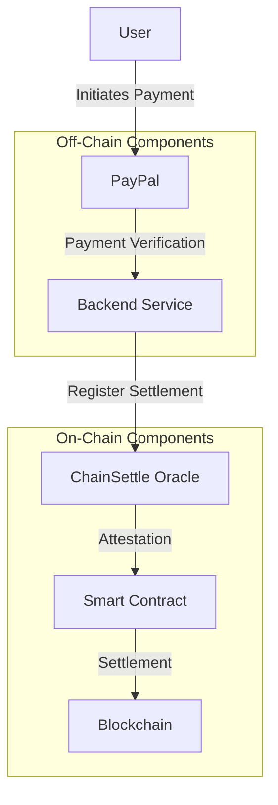
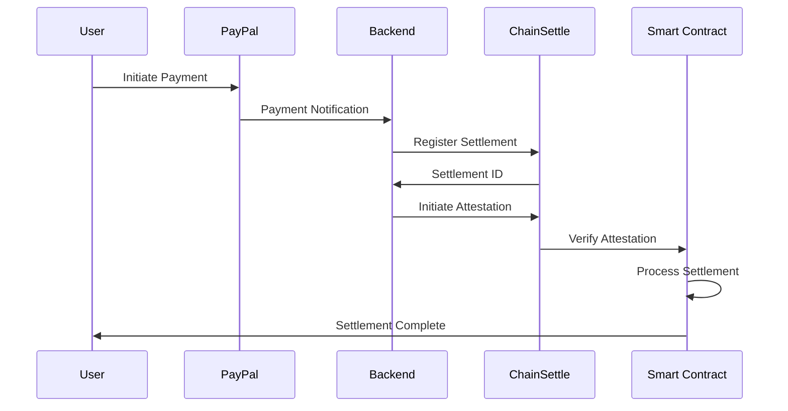
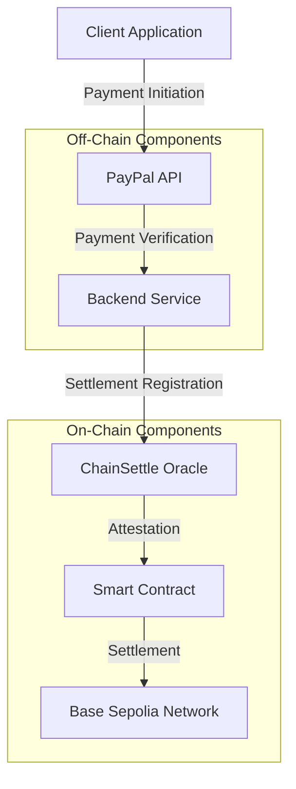
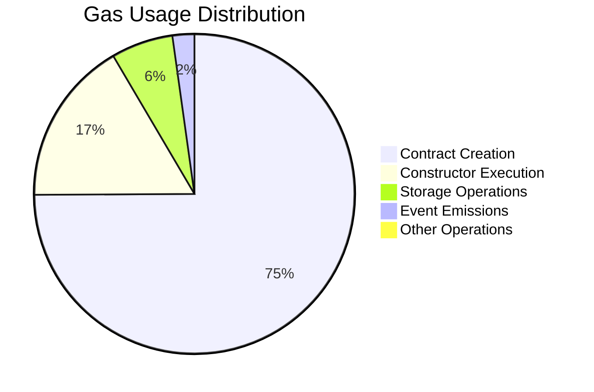
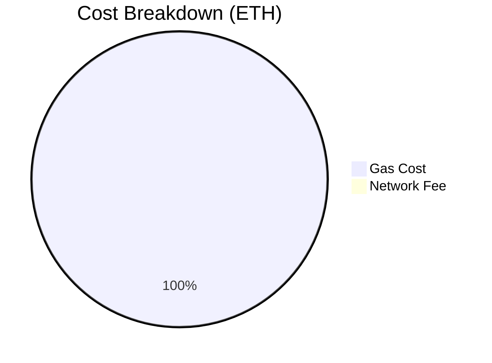
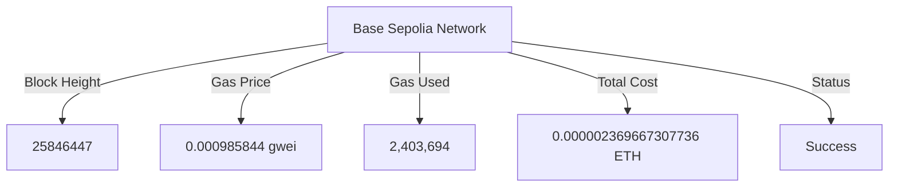
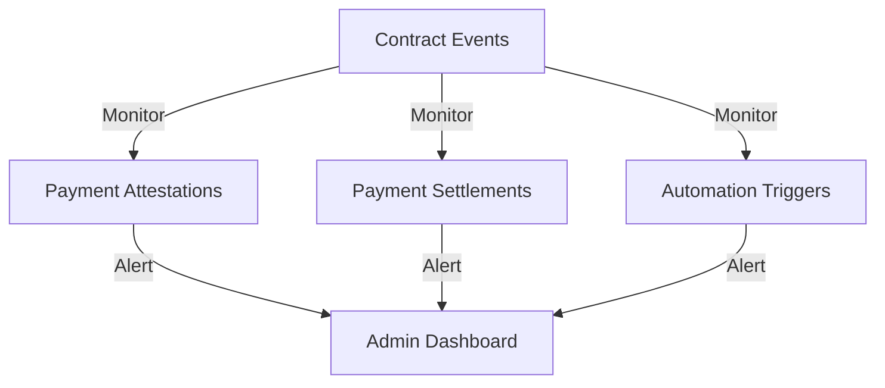

# Settlement Ramp

**Bridge PayPal Payments to On-Chain Settlements on Base Sepolia**


## Overview

Settlement Ramp addresses a critical challenge in Latin America: the high fees,
delays, and complexities when converting PayPal USD payments to local currency
or on-chain stablecoins. This friction blocks access to DeFi, global crypto
commerce, and efficient treasury management.

Built for the Base Batches Hackathon (Stablecoins Track), Settlement Ramp is the
foundation for **Equilibrio** – an open platform connecting LATAM's payment
rails with the on-chain world, with plans to support protocols like
[x402](https://www.x402.org/).

## Architecture

Settlement Ramp bridges off-chain payments with on-chain settlements through:



The system operates in three key stages:

1. **Off-Chain Trigger:** PayPal Sandbox payment detected by ChainSettle oracle
   (Akash)
2. **On-Chain Verification:** ChainSettle submits signed attestation to the
   smart contract
3. **Automated Settlement:** Contract verification triggers Chainlink Automation

## Workflow



## Core Components

### Smart Contracts (Foundry)

The modular contract architecture includes:

#### Core Components

- **SettlementRamp.sol**: Main contract for settlement logic
  - Inherits `Ownable` and `ReentrancyGuard` for security
  - Implements `AutomationCompatibleInterface` for Chainlink integration
  - Manages payment lifecycle from attestation to settlement

#### Interfaces

- **ISettlementRegistry**: ChainSettle oracle interaction
- **IChainSettleAttest**: Attestation verification
- **AutomationCompatibleInterface**: Chainlink Automation integration

#### Security Features

- Authorized attesters access control
- Payment amount validation and limits
- Reentrancy protection
- Automated settlement verification
- Configurable check intervals and retry limits

### Backend Services (FastAPI)

- **Core Services**:
  - `ChainSettleService`: Settlement registration and attestation
  - `PayPalService`: Payment verification
  - `BlockchainService`: Blockchain interactions
- **Key API Endpoints**:
  - `POST /api/settlements/register`: Register new settlement
  - `POST /api/settlements/{settlement_id}/attest`: Initiate attestation
  - `GET /api/settlements/{settlement_id}/status`: Check status
  - `GET /api/settlements/{settlement_id}/activity`: Monitor activity
- **Features**:
  - Environment-based configuration
  - Settlement monitoring with configurable intervals
  - Error handling with HTTP exceptions
  - Optional email notifications
  - Metadata support

### Frontend (React/Vite)

- Built with create-wagmi template and OnchainKit
- Wallet connection and contract event monitoring
- Payment initiation and transaction status UI

## Project Structure

```
settlement-ramp/
├── backend/                 # FastAPI service
│   ├── src/                 # Source code
│   └── tests/               # Unit tests
├── contracts/               # Solidity contracts
│   ├── src/                 # Contract code
│   ├── test/                # Tests
│   └── script/              # Deployment scripts
└── frontend/                # React/Vite frontend
    ├── src/                 # Source code
    └── public/              # Static assets
```

## Configuration

### Environment Variables

```bash
# Base Sepolia Configuration
BASE_SEPOLIA_RPC_URL=
SETTLEMENT_RAMP_CONTRACT_ADDRESS=
SETTLEMENT_REGISTRY_ADDRESS=

# ChainSettle Configuration
CHAINSETTLE_API_URL=
CHAINSETTLE_AKASH_URL=

# PayPal Configuration
PAYPAL_CLIENT_ID=
PAYPAL_CLIENT_SECRET=

# Security
PRIVATE_KEY=

# API Configuration
API_HOST=0.0.0.0
API_PORT=8000
DEBUG=True
```

## Security Considerations

1. Private key management
2. API key security
3. Smart contract security
4. Oracle verification
5. Payment validation

## Deployment

### Smart Contract Deployment

1. Compile contracts using Forge
2. Deploy to Base Sepolia
3. Verify contract on Basescan
4. Update environment variables

### Backend Deployment

1. Set up Python 3.8+ environment
2. Install dependencies from requirements.txt
3. Configure environment variables
4. Start application with uvicorn

## Testing

### Smart Contract Tests

```bash
forge test
```

### Backend Tests

```bash
pytest
```

## Getting Started

### Prerequisites

- **ChainSettle Node (Akash):** Configured with PayPal Sandbox API credentials
- **PayPal Sandbox Account:** For test payments
- **Chainlink Automation (Base Sepolia):** LINK-funded upkeep
- **Base Sepolia Account:** For contract deployment
- **Development Tools:** pnpm, Foundry, Node.js

### Installation

1. Clone the repository:
   ```bash
   git clone https://github.com/tapilew/settlement-ramp.git
   cd settlement-ramp
   ```
2. Install dependencies:
   ```bash
   pnpm install
   ```
3. Configure environment:
   ```bash
   cp .env.example .env
   # Edit .env with your configuration
   ```

### Deployment Steps

1. **Deploy ChainSettle Node to Akash**
2. **Deploy Settlement Ramp Contract to Base Sepolia**:
   ```bash
   pnpm forge script scripts/DeploySettlementRamp.s.sol:DeployScript --rpc-url $BASE_SEPOLIA_RPC_URL --private-key $DEPLOYER_PRIVATE_KEY --broadcast --verify --verifier basescan --verifier-url https://api-sepolia.basescan.org/api
   ```
3. **Configure Chainlink Automation** for the `PaymentAttested` event
4. **Run UI**: `pnpm dev`

## Future Roadmap

The broader Equilibrio vision includes:

- **Live & Localized Payments:** PayPal APIs and LATAM payment methods
- **Full USDC Settlement:** Automated settlement on Base mainnet
- **Fintech & Exchange Integration:** SDKs and third-party tools
- **Off-Ramp Capabilities:** Fiat payout flows
- **Protocol Enhancements:** x402 protocol integration
- **Enhanced UX:** OnchainKit components and Basenames integration
- **Production Readiness:** Robust error handling and security audits

## Acknowledgments

- **ChainSettle oracle system**
  ([GitHub](https://github.com/BrandynHamilton/chainsettle)) by Brandyn Hamilton
- **Chainlink Automation** for on-chain event triggering
- **Base Sepolia** for the underlying blockchain infrastructure
- **Equilibrio ecosystem**
  ([GitHub](https://github.com/tapilew/equilibrio-alpha)) for LATAM financial
  infrastructure

## Detailed Documentation

### Executive Summary
Settlement Ramp is an enterprise-grade blockchain solution that bridges traditional payment systems (PayPal) with blockchain settlements. This system provides a secure, automated, and transparent way to verify and settle payments using smart contracts and a robust backend infrastructure.

### System Architecture

#### High-Level Architecture


### Smart Contract: SettlementRamp

#### Contract Details
```
Contract: SettlementRamp
Address: 0xdA7248aD6DB23139605Ef5F8De0C6d9C9c8313Ae
Network: Base Sepolia
Transaction Hash: 0xf8ca6f0b94312b80842ec70566b695cf9211b0edde92241fa029836b3a7fa714
Block Number: 25846447
```

#### Technical Specifications

##### State Variables
```solidity
// Payment tracking
mapping(bytes32 => Payment) public payments;
mapping(bytes32 => bool) public isSettled;

// Access control
mapping(address => bool) public authorizedAttesters;

// Payment limits
uint256 public minPaymentAmount;
uint256 public maxPaymentAmount;

// Constants
uint256 public constant MAX_CHECK_COUNT = 10;
uint256 public constant CHECK_INTERVAL = 1 hours;
```

##### Key Functions

1. **Payment Attestation**
```solidity
function attestPayment(
    bytes32 escrowId,
    address payer,
    uint256 amount,
    string calldata paypalTxId
) external onlyAuthorizedAttester validAmount(amount)
```

2. **Payment Settlement**
```solidity
function settlePayment(bytes32 escrowId) 
    external 
    onlyAuthorizedAttester 
    nonReentrant
```

3. **Payment Verification**
```solidity
function getPaymentDetails(bytes32 escrowId) 
    external 
    view 
    returns (
        address payer,
        uint256 amount,
        bool settled,
        string memory paypalTxId,
        uint256 lastCheckTimestamp,
        uint256 checkCount
    )
```

### Security Features

#### Access Control
- OpenZeppelin's Ownable implementation
- Authorized attester management
- Role-based access control
- Secure function modifiers

#### Reentrancy Protection
- OpenZeppelin's ReentrancyGuard
- Secure payment processing
- Protected state modifications
- Atomic operations

#### Payment Validation
- Amount range checks
- Attestation verification
- Settlement confirmation
- Transaction integrity

### Automation Integration

#### Chainlink Automation
```solidity
function checkUpkeep(bytes calldata) 
    external 
    view 
    returns (bool upkeepNeeded, bytes memory)

function performUpkeep(bytes calldata) 
    external
```

### Deployment Details

#### Deployment Transaction Analysis
```json
{
    "network": "Base Sepolia",
    "contract_address": "0xdA7248aD6DB23139605Ef5F8De0C6d9C9c8313Ae",
    "transaction_hash": "0xf8ca6f0b94312b80842ec70566b695cf9211b0edde92241fa029836b3a7fa714",
    "block_number": 25846447,
    "gas_used": 2403694,
    "gas_price": "0.000985844 gwei",
    "total_cost": "0.000002369667307736 ETH"
}
```

#### Transaction Analysis Charts

##### Gas Usage Distribution


##### Cost Breakdown


##### Transaction Timeline

```mermaid
gantt
    title Transaction Timeline
    dateFormat  X
    axisFormat %s
    
    section Transaction
    Contract Creation    :0, 1800000
    Constructor Execution :1800000, 2200000
    Storage Operations   :2200000, 2350000
    Event Emissions      :2350000, 2403694
```


##### Network Statistics


### Post-Deployment Considerations

#### Monitoring Requirements


#### Maintenance Procedures
- Regular balance checks
- Gas optimization
- Security updates
- Performance monitoring

#### Emergency Procedures
- Pause mechanism
- Emergency withdrawal
- Admin controls
- Backup systems

### Future Improvements

#### Technical Roadmap
- Dynamic payment limits
- Enhanced automation
- Multi-currency support
- Cross-chain capabilities

#### Feature Development
- User dashboard
- Analytics integration
- Mobile application
- API enhancements

### Integration Points

#### 1. ChainSettle Integration
- Settlement Registry Interface
- Attestation System
- Node Communication
- Status Updates

#### 2. PayPal Integration
- Payment Verification
- Transaction Tracking
- Status Updates
- Error Handling

### Usage Guidelines

#### Payment Attestation Process
1. Verify payment amount is within limits
2. Check ChainSettle attestation
3. Call attestPayment with parameters
4. Monitor PaymentAttested event

#### Settlement Process
1. Verify payment exists
2. Check ChainSettle finalization
3. Call settlePayment
4. Monitor PaymentSettled event

#### Monitoring and Maintenance
1. Regular balance checks
2. Automation status monitoring
3. Event log analysis
4. Gas usage optimization
5. Security updates

### Security Considerations

#### Access Control
- Role-based permissions
- Multi-signature support
- Time-locked operations
- Emergency procedures

#### Data Integrity
- Immutable records
- Verified attestations
- Secure settlements
- Audit trails

### Monitoring and Maintenance

#### Regular Checks
1. Contract balance
2. Automation status
3. Event logs
4. Gas usage
5. Security updates

#### Maintenance Procedures
1. Regular updates
2. Security patches
3. Performance optimization
4. Documentation updates
5. User support
