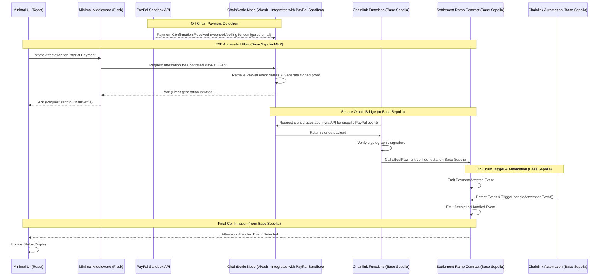

# Settlement Ramp

**Automated On-Chain Settlement on Base Sepolia Triggered by Verified PayPal
Sandbox Payments**

`<place-settlement-ramp-logo-here>`

## The Problem We're Solving: The LATAM PayPal Bottleneck

For countless freelancers, businesses, and individuals across Latin America
(LATAM), PayPal is a primary gateway for receiving international USD payments.
However, a significant "hair-on-fire" problem arises when they try to move these
funds:

- **Into Local Circulation:** Converting PayPal USD to local currency often
  involves high fees, unfavorable exchange rates, and slow bank transfers.
- **Into the Global Crypto Economy:** On-ramping these USD funds to stablecoins
  like USDC on efficient blockchains such as Base is cumbersome, costly, and
  lacks direct, automated pathways.

This friction creates the **"PayPal bottleneck"**: LATAM users have USD in their
PayPal accounts but face significant barriers to efficiently utilizing these
funds within their local economies or the burgeoning on-chain digital asset
ecosystem. Settlement Ramp aims to dismantle this bottleneck by building the
secure, automated **bridge infrastructure** connecting off-chain payment
confirmations (starting with PayPal) to programmable, automated actions on Base.

## Core Focus: MVP for Base Sepolia (Stablecoins Track)

For the Base Batches Buildathon, Settlement Ramp is laser-focused on
demonstrating the **core technical mechanism** of this bridge: the secure
attestation, verification, and automated triggering of on-chain actions on
**Base Sepolia**, using a real-world off-chain payment event.

Our MVP directly addresses the PayPal bottleneck by: **Demonstrating ChainSettle
(on Akash) attesting to a payment confirmation received directly within the
PayPal Sandbox environment. This simulates a LATAM user receiving an
international USD payment via PayPal.**

This MVP delivers:

1. **PayPal Sandbox Event Attestation (ChainSettle on Akash):** ChainSettle
   integrates with the PayPal Sandbox API to detect a payment confirmation sent
   to a pre-configured recipient email address and generates a cryptographic
   proof for this event.
2. **Off-Chain Verification (Chainlink Functions on Base Sepolia):**
   Cryptographically verifies the ChainSettle attestation proof.
3. **On-Chain Event Emission (Settlement Ramp Contract on Base Sepolia):**
   Receives the verified attestation from Chainlink Functions and emits
   `PaymentAttested`.
4. **Automated On-Chain Action (Chainlink Automation on Base Sepolia):** Listens
   for `PaymentAttested` and automatically triggers `handleAttestationEvent` on
   the Base Sepolia contract.
5. **Minimal UI & Middleware:** A basic UI initiates the request for ChainSettle
   to process the PayPal Sandbox event, providing visual confirmation of the E2E
   automation on Base Sepolia.

**Why this infrastructure matters for LATAM and USDC on Base:** This
foundational bridge, validated by our MVP, is the critical first step towards
enabling transformative solutions, such as:

- **Automated Stablecoin On-Ramps:** Imagine a service like
  `exchange@paypal4usdc.com` where a PayPal payment automatically triggers a
  USDC mint/transfer on Base.
- **More Efficient P2P Exchange Services:** Reducing friction for LATAM users to
  access USDC from their PayPal balances.
- **Improved Treasury Automation:** Allowing LATAM businesses to seamlessly
  integrate PayPal receipts with on-chain financial operations.

While this MVP focuses on the _event trigger from PayPal Sandbox_, the ultimate
vision is to significantly improve USDC accessibility and utility on Base for
LATAM users by automating the on-ramp process from globally recognized payment
platforms like PayPal.

## Technical Architecture: A Multi-Layered Bridge (Base Sepolia MVP)

Our architecture combines specialized, decentralized components for security and
reliability:

1. **ChainSettle Node (Akash - PayPal Sandbox Integration)**:
   - Integrates directly with the **PayPal Sandbox API** to detect payment
     confirmations sent to a configured recipient email address.
   - Generates cryptographically signed attestations for these PayPal Sandbox
     events. _(Using PayPal Sandbox provides a realistic and verifiable
     off-chain payment event for this MVP, demonstrating the core mechanism with
     a widely-used payment platform.)_
   - Exposed securely via an API endpoint hosted on the decentralized Akash
     Network.
2. **Chainlink Functions (Attestation Verification - Base Sepolia)**:
   - Acts as a secure, decentralized off-chain computation layer, configured for
     **Base Sepolia**.
   - Retrieves the signed attestation data (for a specific PayPal Sandbox event)
     from the ChainSettle API endpoint.
   - Independently verifies the cryptographic signature using ChainSettle's
     known public key.
   - If valid, calls the `Settlement Ramp` contract on **Base Sepolia**, passing
     the verified attestation data.
3. **Settlement Ramp Contract (Base Sepolia)**:
   - A minimal, focused smart contract deployed on **Base Sepolia**.
   - Receives calls strictly from the authorized Chainlink Functions oracle
     address (configured for Base Sepolia).
   - Upon receiving verified data via `attestPayment`, emits `PaymentAttested`.
   - Includes `handleAttestationEvent` triggered _only_ by Chainlink Automation
     (configured for Base Sepolia).
4. **Chainlink Automation (Event Listener & Trigger - Base Sepolia)**:
   - An Upkeep registered on the Chainlink Automation network for **Base
     Sepolia**.
   - Monitors the `PaymentAttested` event on the Base Sepolia contract.
   - Automatically triggers `handleAttestationEvent` upon detection.
5. **Minimal UI (React/Tailwind/Vite) & Middleware (Python/Flask)**:
   - UI provides a button to trigger the attestation flow for a confirmed PayPal
     Sandbox payment.
   - Middleware receives the UI trigger, calls the ChainSettle Akash API (to
     process the PayPal event), and returns.
   - UI listens for the final `AttestationHandled` event on **Base Sepolia** for
     status updates.



## Security Model: Defense in Depth (Targeting Base Sepolia)

Our layered architecture provides robust security guarantees for the bridging
mechanism:

1. **Payment Verification & Attestation Integrity (ChainSettle on Akash with
   PayPal Sandbox):** Ensures ChainSettle accurately reflects a confirmed PayPal
   Sandbox payment and that attestation generation/signing occur within its
   controlled environment.
2. **Cryptographic Proof Verification (Chainlink Functions for Base Sepolia):**
   Decentralized verification of the attestation's authenticity _before_ hitting
   the **Base Sepolia** blockchain.
3. **On-Chain Authorization (Settlement Ramp Contract on Base Sepolia):**
   Contract enforces that only the authorized Chainlink Functions oracle (for
   Base Sepolia) can call `attestPayment`.
4. **Automated Reaction Security (Chainlink Automation for Base Sepolia):**
   Ensures the follow-up action (`handleAttestationEvent`) is triggered reliably
   and decentrally _only_ upon the verified `PaymentAttested` event on **Base
   Sepolia**.

## Implementation Highlights (MVP for Base Sepolia)

### 1. ChainSettle Node with PayPal Sandbox Integration (Akash)

- ChainSettle is configured to monitor a specific recipient email address within
  the **PayPal Sandbox environment** using PayPal's APIs (e.g., for webhooks or
  polling recent transactions).
- Upon detecting a payment to this email, ChainSettle retrieves the transaction
  details and generates a signed JSON proof.
- The "trigger" for the demo flow involves making a payment to this email in the
  PayPal Sandbox. The UI/Middleware then prompts ChainSettle to specifically
  process and attest to this (or the latest) confirmed PayPal event.

### 2. Chainlink Functions Script (for Base Sepolia)

- JavaScript using **viem** to call the ChainSettle Akash API (to fetch the
  signed proof of a PayPal Sandbox payment), perform `verifyMessage`, and encode
  the call to `attestPayment` for the contract on **Base Sepolia**.

```javascript
// Conceptual Chainlink Functions Script Snippet (targeting Base Sepolia)
import { createPublicClient, hashMessage, http, recoverAddress } from "viem";
// ... (setup Functions, secrets for CHAINSETTLE_API_URL, CHAINSETTLE_AUTH_TOKEN, CHAINSETTLE_PUBLIC_KEY)
// Ensure Chainlink Functions subscription is for Base Sepolia

// Fetch signed attestation of a PayPal Sandbox payment from ChainSettle API
const response = await Functions.makeHttpRequest({
    url: `${secrets.CHAINSETTLE_API_URL}/attestation/paypal-sandbox-event`, // Example endpoint
    // method: "POST", // If ChainSettle needs specific event ID passed by UI/Middleware
    // headers: { Authorization: `Bearer ${secrets.CHAINSETTLE_AUTH_TOKEN}` },
    // data: { eventId: "specific_paypal_event_id_if_applicable" }
});
const signedPayload = response.data; // Assuming JSON { data: {paypalTxInfo...}, signature: "0x..." }

// Verify Signature from ChainSettle Node
const expectedSigner = secrets.CHAINSETTLE_PUBLIC_KEY;
const messageHash = hashMessage(
    JSON.stringify(signedPayload.data), // Hashing the actual PayPal event data attested by ChainSettle
);
const recoveredAddress = recoverAddress({
    hash: messageHash,
    signature: signedPayload.signature,
});

if (recoveredAddress.toLowerCase() !== expectedSigner.toLowerCase()) {
    throw new Error("Invalid Signature from ChainSettle node");
}

// Encode call data for SettlementRamp.attestPayment(string) on Base Sepolia
const attestationJson = JSON.stringify(signedPayload.data); // Pass verified PayPal event data
return Functions.encodeString(attestationJson);
```

### 3. Settlement Ramp Contract (Base Sepolia)

```solidity
// SPDX-License-Identifier: MIT
pragma solidity ^0.8.19;

// Contract to be deployed on Base Sepolia
contract SettlementRamp {
    // Addresses for Chainlink services on Base Sepolia
    address public immutable chainlinkFunctionsOracle; // Base Sepolia Functions Oracle
    address public immutable chainlinkAutomationRegistry; // Base Sepolia Automation Registry

    event PaymentAttested(bytes32 indexed paymentId, address indexed payer, uint256 amount, uint256 timestamp, string txRefPayPal);
    event AttestationHandled(bytes32 indexed paymentId, uint256 timestamp);

    mapping(bytes32 => bool) public isAttestationHandled;

    constructor(address _chainlinkFunctionsOracle_baseSepolia, address _chainlinkAutomationRegistry_baseSepolia) {
        chainlinkFunctionsOracle = _chainlinkFunctionsOracle_baseSepolia;
        chainlinkAutomationRegistry = _chainlinkAutomationRegistry_baseSepolia;
    }

    // Called by Chainlink Functions on Base Sepolia with verified PayPal Sandbox payment data
    function attestPayment(string calldata attestationJson) external {
        require(msg.sender == chainlinkFunctionsOracle, "Not Functions Oracle (Base Sepolia)");
        // In a real scenario, parse attestationJson to extract PayPal tx details
        // For MVP, using hash as a simple ID.
        bytes32 paymentId = keccak256(abi.encodePacked(attestationJson));
        // Placeholder values for payer, amount from a real parsed JSON.
        emit PaymentAttested(paymentId, address(0x123), 100*1e18, block.timestamp, "paypal_sandbox_tx_ref_example");
    }

    // Called by Chainlink Automation on Base Sepolia
    function handleAttestationEvent(bytes32 _paymentId) external {
        require(msg.sender == chainlinkAutomationRegistry, "Not Automation Registry (Base Sepolia)");
        require(!isAttestationHandled[_paymentId], "Attestation already handled");
        isAttestationHandled[_paymentId] = true;
        // Minimal action for MVP: emit event. Future: trigger USDC transfer.
        emit AttestationHandled(_paymentId, block.timestamp);
    }
}
```

### 4. Chainlink Automation Upkeep Configuration (Base Sepolia)

- **Trigger:** Event `PaymentAttested(bytes32,address,uint256,uint256,string)`
  from the `SettlementRamp` contract on **Base Sepolia**.
- **Target:** `SettlementRamp` contract address on **Base Sepolia**.
- **Action:** Call `handleAttestationEvent(bytes32)`, mapping `paymentId` from
  the event.
- **Network:** **Base Sepolia**.

### 5. Minimal UI & Middleware (Interacting with Base Sepolia)

- **UI (React/Vite/Tailwind):**
  - Built with modern, lightweight stack using **viem** for **Base Sepolia**
    blockchain interactions.
  - **Key UI Components:**
    - `WalletConnection`: Uses wagmi + RainbowKit for seamless wallet connection
      (configured for **Base Sepolia**).
    - `EventListener`: Uses viem's `watchContractEvent` to monitor
      `AttestationHandled` events from the contract on **Base Sepolia**.
    - `TriggerButton`: Calls middleware endpoint to initiate the attestation
      flow for a (presumed already made) PayPal Sandbox payment.
    - `StatusDisplay`: Shows current state of attestation flow, reflecting
      events from **Base Sepolia**.

  ```javascript
  // Example: Event Listening with viem for Base Sepolia
  import { createPublicClient, http, parseAbiItem } from "viem";
  import { baseSepolia } from "viem/chains"; // Import Base Sepolia chain definition

  // Set up public client for Base Sepolia (use your actual RPC URL)
  const client = createPublicClient({
      chain: baseSepolia, // Specify Base Sepolia
      transport: http(
          process.env.BASE_SEPOLIA_RPC_URL || "https://sepolia.base.org",
      ),
  });

  // Listen for AttestationHandled events from your contract on Base Sepolia
  const unwatch = client.watchContractEvent({
      address: "YOUR_SETTLEMENT_RAMP_CONTRACT_ADDRESS_ON_BASE_SEPOLIA", // Replace with your contract address
      event: parseAbiItem(
          "event AttestationHandled(bytes32 indexed paymentId, uint256 timestamp)",
      ),
      onLogs: (logs) => {
          console.log(
              "AttestationHandled Event detected on Base Sepolia!",
              logs,
          );
          // Update UI status based on Base Sepolia event
      },
  });
  ```

- **Middleware (Flask):**
  - Single endpoint `/initiate-paypal-attestation` receives POST from UI, calls
    ChainSettle Akash API (to prompt processing of a PayPal Sandbox event),
    returns HTTP 200.

## Getting Started (for Base Sepolia MVP)

### Prerequisites

- **ChainSettle Node (on Akash):**
  - Running instance configured with **PayPal Sandbox API credentials** (Client
    ID, Secret).
  - Configured to monitor a specific **PayPal Sandbox recipient email address**
    for incoming payments.
  - API endpoint for requesting attestations of detected PayPal Sandbox
    payments.
- **PayPal Sandbox Account:** Access to a PayPal Sandbox account to send test
  payments to the monitored email address.
- **Chainlink Functions Subscription (Base Sepolia):** Active subscription for
  **Base Sepolia** funded with LINK.
- **Chainlink Automation Upkeep (Base Sepolia):** Registered Upkeep for **Base
  Sepolia** funded with LINK.
- **Base Sepolia Account:** Wallet with private key funded with Base Sepolia ETH
  (for deployment and gas).
- **pnpm:** Node.js package manager (`npm install -g pnpm`).
- **Foundry:** Smart contract toolkit
  (`curl -L https://foundry.paradigm.xyz | bash` then `foundryup`).
- **Python 3 & uv:** For the Flask middleware. Install uv with
  `curl -sSf https://astral.sh/uv/install.sh | bash`.

### Deployment Steps (All for Base Sepolia)

1. **Deploy & Configure ChainSettle Node to Akash:**
   - Follow guides for deploying to Akash.
   - Implement logic to connect to PayPal Sandbox API, monitor the designated
     recipient email for payments, and generate signed attestations.
   - Secure the ChainSettle API endpoint. Note API URL & any necessary Auth
     details.
2. **Deploy Settlement Ramp Contract to Base Sepolia:**
   - Update deployment script (`scripts/DeploySettlementRamp.s.sol`) with
     correct Chainlink Functions Oracle and Automation Registry addresses for
     **Base Sepolia** (refer to Chainlink documentation).
   - Set `DEPLOYER_PRIVATE_KEY` (funded on Base Sepolia) and
     `BASE_SEPOLIA_RPC_URL` (e.g., `https://sepolia.base.org`) in `.env`.
   - Run:
     `pnpm forge script scripts/DeploySettlementRamp.s.sol:DeployScript --rpc-url $BASE_SEPOLIA_RPC_URL --private-key $DEPLOYER_PRIVATE_KEY --broadcast --verify --verifier basescan --verifier-url https://api-sepolia.basescan.org/api`
   - Note the deployed contract address from **Base Sepolia Explorer**
     (`https://sepolia.base.org/`).
3. **Configure & Deploy Chainlink Function (Base Sepolia):**
   - Update your Chainlink Functions script to call your ChainSettle API
     endpoint for PayPal Sandbox attestations.
   - Set secrets in `.env` (e.g., `CHAINSETTLE_API_URL`,
     `CHAINSETTLE_PUBLIC_KEY`).
   - Create these secrets on Chainlink Functions UI for **Base Sepolia**.
   - Deploy your Functions script using Chainlink toolkit, targeting **Base
     Sepolia**.
   - Add your **Base Sepolia** contract address as an authorized consumer to
     your Functions subscription on Base Sepolia.
4. **Register Chainlink Automation Upkeep (Base Sepolia):**
   - Use the Chainlink Automation App, selecting **Base Sepolia**.
   - Register Upkeep (Custom logic -> Event trigger).
   - Enter your **Base Sepolia** contract address & `PaymentAttested` event
     signature.
   - Configure action to call `handleAttestationEvent(bytes32)`, mapping
     `paymentId`.
   - Fund the Upkeep with LINK on **Base Sepolia**.
5. **Run Middleware & UI (Connecting to Base Sepolia):**
   - Configure middleware (`.env` with ChainSettle API details).
   - Install middleware dependencies:
     `cd middleware && uv pip install -r requirements.txt`.
   - Run Flask server: `python app.py`.
   - Configure UI (`.env` with middleware URL, your **Base Sepolia** contract
     address, and **Base Sepolia RPC URL**). Run Vite dev server (`pnpm dev`).

### Running the Automated Flow (on Base Sepolia)

1. **Make a PayPal Sandbox Payment:**
   - Using your PayPal Sandbox account, send a payment to the specific email
     address that your ChainSettle node is configured to monitor.
2. **Ensure Systems are Ready:**
   - Confirm all deployed components (ChainSettle, Contract, Chainlink Functions
     & Automation) are configured, funded (LINK, ETH on Base Sepolia), and
     running.
3. **Initiate Attestation via UI:**
   - Open the Minimal UI in your browser. Connect your wallet (ensure network is
     **Base Sepolia**).
   - Click the "Attest PayPal Payment" (or similarly named) button. This will
     call the middleware, which in turn requests ChainSettle to process the
     PayPal Sandbox payment event it detected.
4. **Monitor (on Base Sepolia & other systems):**
   - UI status updates ("Requesting Attestation..." -> "Waiting for Base
     Sepolia..." -> "Attestation Handled on Base Sepolia!").
   - Middleware logs confirming call to ChainSettle.
   - ChainSettle node logs confirming detection of PayPal payment and
     generation/serving of attestation.
   - Chainlink Functions UI for request execution on **Base Sepolia**.
   - **Base Sepolia Explorer** (`https://sepolia.base.org/`) for the incoming
     transaction to `attestPayment` on your contract.
   - **Base Sepolia Explorer** for the `PaymentAttested` event.
   - Chainlink Automation UI for the Upkeep performing on **Base Sepolia**.
   - **Base Sepolia Explorer** for the incoming transaction to
     `handleAttestationEvent`.
   - **Base Sepolia Explorer** for the `AttestationHandled` event.
   - UI displaying final "Attestation Handled!" status with a link to the
     handling transaction on **Base Sepolia Explorer**.

## Demo & Validation (Base Sepolia)

- **Proof:** Successful E2E execution demonstrated via **Base Sepolia Explorer**
  (`https://sepolia.base.org/`) links for the `attestPayment` transaction,
  `PaymentAttested` event, `handleAttestationEvent` transaction, and
  `AttestationHandled` event. All on **Base Sepolia**.
- **Video:** [Watch the 1-2 minute demo video](https://youtu.be/demo-link)
  _(Placeholder - will show PayPal Sandbox payment triggering Base Sepolia
  flow)_

## Future Roadmap (Post-Hackathon)

This MVP establishes the core automated bridge from PayPal Sandbox to Base
Sepolia. Future work will focus on:

- **Live PayPal Integration:** Transition from PayPal Sandbox to live PayPal
  APIs for production use-cases, handling live payment events.
- **Direct USDC Settlement Logic:** Implement actual USDC transfers or mints on
  Base (mainnet) triggered by the `handleAttestationEvent`, completing the
  on-ramp.
- **Broader LATAM Payment Integration:** Explore integrations with _actual_
  LATAM local payment methods (e.g., bank transfers, popular local e-wallets) as
  APIs become available, or investigate alternative verification methods (e.g.,
  leveraging technologies like those explored by zkp2p for off-chain payment
  verification).
- **Enhanced Data Handling & Security:** Implement robust parsing of PayPal
  transaction data, more comprehensive error handling, and further security
  hardening for production.
- **User/Merchant Configuration & UX:** Develop interfaces for users/merchants
  to configure settings (e.g., destination wallets, notification preferences)
  and improve the overall user experience for on-ramping.
- **Gas Abstraction:** Explore mechanisms for sponsoring transaction costs on
  Base to simplify the user experience.

## Acknowledgments

- Directly leverages and adapts the conceptual attestation framework of
  **[ChainSettle](https://github.com/BrandynHamilton/chainsettle)** by Brandyn
  Hamilton.
- Utilizes **Akash Network** for decentralized hosting of the ChainSettle node.
- Powered by **Chainlink Functions** & **Chainlink Automation** on **Base
  Sepolia** for this MVP.
- Built on **Base Sepolia** for the Base Batches Buildathon (Stablecoins Track).
- Leverages **PayPal Sandbox** for realistic off-chain payment event simulation.
