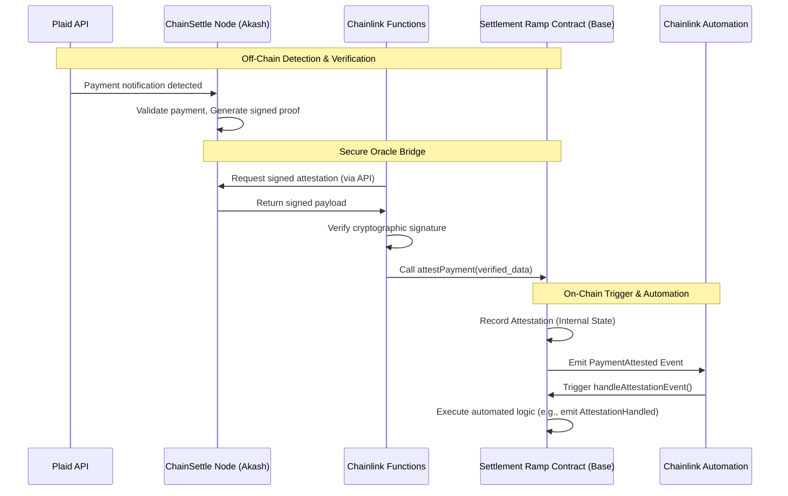
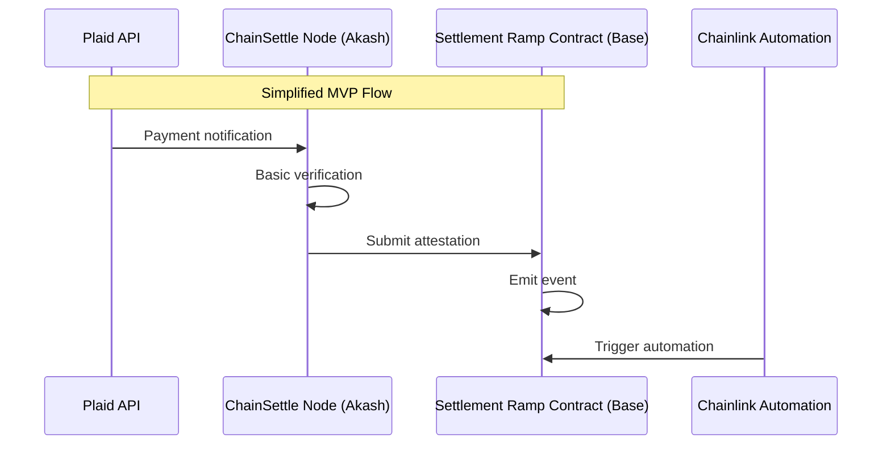
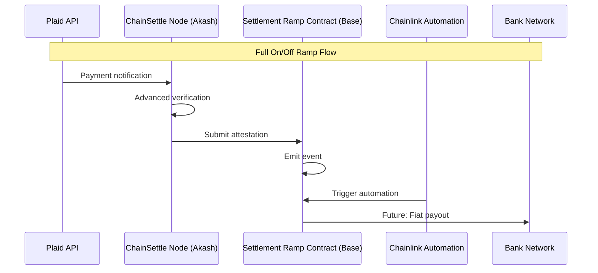

# Settlement Ramp

**Automated On-Chain Settlement Triggered by Verified Fiat Payments on Base**

`<place-settlement-ramp-logo-here>`

## Core Focus: Automated On-Chain Reaction

Settlement Ramp is laser-focused on demonstrating the **automated triggering of
on-chain actions on Base** based on verified off-chain fiat payment
confirmations. We achieve this through a robust, multi-layered oracle
architecture:

1. **ChainSettle (Akash):** Verifies the real-world payment event using external
   APIs (e.g., Plaid) and generates a cryptographic proof.
2. **Chainlink Functions:** Cryptographically verifies the ChainSettle
   attestation proof off-chain in a decentralized manner.
3. **Settlement Ramp Contract (Base):** Receives the verified attestation
   on-chain from the trusted Chainlink oracle and emits a crucial event
   (`PaymentAttested`).
4. **Chainlink Automation:** Listens for the `PaymentAttested` event and
   automatically triggers a subsequent, predefined on-chain function call
   (`handleAttestationEvent`).

This integrated system provides a trust-minimized pathway for merchants to
automate complex treasury operations and business logic directly on the Base
blockchain, reacting instantly and reliably to real-world payment settlements.

## Technical Architecture: A Multi-Layered Bridge

Our architecture combines specialized, decentralized components for maximum
security and reliability:

1. **ChainSettle Node (Akash)**:
   - Handles direct API integrations (e.g., Plaid) to detect and validate fiat
     payment events.
   - Generates cryptographically signed attestations as proof of verification
     using its private key.
   - Exposed securely via an API endpoint hosted on the decentralized Akash
     Network.
2. **Chainlink Functions (Attestation Verification)**:
   - Acts as a secure, decentralized off-chain computation layer.
   - Retrieves signed attestation data from the ChainSettle API endpoint.
   - Independently verifies the cryptographic signature using ChainSettle's
     known public key.
   - If valid, calls the `Settlement Ramp` contract on Base, passing the
     verified attestation data.
3. **Settlement Ramp Contract (Base)**:
   - A minimal, focused smart contract deployed on Base.
   - Receives calls strictly from the authorized Chainlink Functions oracle
     address.
   - Upon receiving verified data via `attestPayment`, records necessary details
     and emits a `PaymentAttested` event.
   - Includes a target function (`handleAttestationEvent`) designed to be
     triggered _only_ by Chainlink Automation.
4. **Chainlink Automation (Event Listener & Trigger)**:
   - An Upkeep registered on the Chainlink Automation network for Base.
   - Monitors the `PaymentAttested` event emitted by the `Settlement Ramp`
     contract.
   - When the event is detected, it automatically triggers the registered
     `handleAttestationEvent` function on the `Settlement Ramp` contract,
     ensuring automated follow-through.



## Security Model: Defense in Depth

Our layered architecture provides robust security guarantees:

1. **Off-Chain Verification Integrity (ChainSettle on Akash):** Ensures the
   initial real-world payment event detection and attestation signing occur
   within the controlled environment of the ChainSettle node, managing API keys
   securely.
2. **Cryptographic Proof Verification (Chainlink Functions):** Adds a critical
   decentralized verification layer. The attestation's authenticity (via
   signature) is independently confirmed by the Chainlink DON _before_ any state
   change occurs on Base.
3. **On-Chain Authorization (Settlement Ramp Contract):** The contract strictly
   enforces that only the authorized Chainlink Functions oracle address can
   submit attestations via the `attestPayment` function.
4. **Automated Reaction Security (Chainlink Automation):** Ensures that the
   follow-up action (`handleAttestationEvent`) is triggered reliably and
   decentrally _only_ upon the verified `PaymentAttested` event, preventing
   manipulation or reliance on centralized triggers for downstream processes.

This combination minimizes trust assumptions and creates a highly reliable
bridge between off-chain events and automated on-chain actions.

## Implementation Highlights (MVP)

### 1. ChainSettle API Endpoint (Akash)

A secure, authenticated endpoint (e.g., `/api/v1/attestations/<escrow_id>`) on
the Akash-hosted ChainSettle node, returning JSON containing the payment details
and the cryptographic signature (proof).

### 2. Chainlink Functions Script

JavaScript code executed by the Chainlink DON:

- Fetches the signed attestation JSON from the ChainSettle API.
- Uses `ethers.js` (available in the Functions runtime) to perform
  `verifyMessage` using the known ChainSettle public key.
- Throws an error if verification fails.
- If successful, encodes the verified payload (e.g., as a JSON string or
  structured bytes) and returns it for the Chainlink node to use in the
  `attestPayment` call.

### 3. Settlement Ramp Contract (Base)

```solidity
// SPDX-License-Identifier: MIT
pragma solidity ^0.8.19;

contract SettlementRamp {
    address public immutable chainlinkFunctionsOracle;
    address public immutable chainlinkAutomationRegistry; // Automation Registry address

    // Event emitted when a fiat payment is attested on-chain by the oracle
    event PaymentAttested(
        bytes32 indexed escrowId,
        address indexed merchant, // Simulated/derived merchant address
        uint256 amount, // Amount (in base units or similar)
        uint256 timestamp,
        string transactionId // Identifier from the off-chain system
    );

    // Event emitted when Chainlink Automation triggers the handler
    event AttestationHandled(
        bytes32 indexed escrowId,
        uint256 timestamp
    );

    // Simple mapping to prevent re-handling attestations (optional but good practice)
    mapping(bytes32 => bool) public isAttestationHandled;

    constructor(address _chainlinkFunctionsOracle, address _chainlinkAutomationRegistry) {
        chainlinkFunctionsOracle = _chainlinkFunctionsOracle;
        chainlinkAutomationRegistry = _chainlinkAutomationRegistry;
    }

    // --- Core Attestation Function ---
    // Called ONLY by the authorized Chainlink Functions Oracle upon verified attestation
    function attestPayment(string calldata attestationJson) external {
        require(msg.sender == chainlinkFunctionsOracle, "Caller is not the authorized Functions oracle");

        // --- Data Extraction (Requires robust parsing in production) ---
        // For MVP, simulate extraction or assume fixed format passed by Function
        bytes32 escrowId = bytes32(keccak256(abi.encodePacked("simulated-id-", attestationJson))); // Placeholder ID
        address merchant = address(0x123); // Placeholder merchant
        uint256 amount = 10000; // Placeholder amount
        uint256 timestamp = block.timestamp; // Use block timestamp
        string memory transactionId = "simulated_tx_id"; // Placeholder
        // --- End Data Extraction ---

        // Emit the event to signal successful attestation
        emit PaymentAttested(
            escrowId,
            merchant,
            amount,
            timestamp,
            transactionId
        );
        // Note: The isAttestationHandled flag is NOT set here, only when Automation acts.
    }

    // --- Automation Triggered Handler ---
    // This function is called ONLY by the Chainlink Automation Registry
    // It is triggered automatically when a PaymentAttested event is detected by an Upkeep
    function handleAttestationEvent(bytes32 _escrowId) external {
        // Ensure caller is the authorized Automation Registry
        require(msg.sender == chainlinkAutomationRegistry, "Caller is not the authorized Automation Registry");

        // Prevent re-entrancy or handling the same event multiple times
        require(!isAttestationHandled[_escrowId], "Attestation already handled");
        isAttestationHandled[_escrowId] = true;

        // --- Execute Downstream Automated Logic Here ---
        // Examples:
        // - Trigger USDC transfer from an escrow contract
        // - Update a merchant's on-chain balance
        // - Call another contract's function
        // --- End Automated Logic ---

        // For this MVP, we just emit an event to confirm handling
        emit AttestationHandled(_escrowId, block.timestamp);
    }

    // Consider adding functions for owner to update oracle/registry addresses if needed,
    // protected by appropriate access control (e.g., Ownable pattern).
}
```

_Note: Smart contract code includes simulated data extraction for MVP
simplicity. Production code requires robust data parsing (e.g., using a library
or ensuring Functions passes structured data) and appropriate access controls._

### 4. Chainlink Automation Upkeep Configuration

An Upkeep registered via the Chainlink Automation App for Base:

- **Trigger Type:** Event
- **Contract Address:** Your deployed `Settlement Ramp` contract address.
- **Event Signature:**
  `PaymentAttested(bytes32, address, uint256, uint256, string)`
- **Action:** Call the `handleAttestationEvent(bytes32)` function on the
  `Settlement Ramp` contract.
- **Input Mapping:** Configure the Upkeep to extract the `escrowId` (the first
  indexed `bytes32` parameter) from the event log and pass it as the argument to
  `handleAttestationEvent`.

## Getting Started

### Prerequisites

- **ChainSettle Node:** Running instance on Akash with API endpoint, Plaid keys
  (Sandbox), and Base wallet configured.
- **Chainlink Functions Subscription:** Active subscription funded with LINK.
- **Chainlink Automation Upkeep:** Registered Upkeep funded with LINK.
- **Base Account:** Wallet with private key funded with ETH for contract
  deployment and gas fees on Base Mainnet.
- **pnpm:** Node.js package manager (`npm install -g pnpm`).
- **Foundry:** Smart contract toolkit
  (`curl -L https://foundry.paradigm.xyz | bash` then `foundryup`).

### Deployment Steps

1. **Deploy ChainSettle Node to Akash:** Follow ChainSettle/Akash guides. Secure
   the API endpoint and configure the Base wallet.
2. **Deploy Settlement Ramp Contract to Base:**
   - Update deployment script (`scripts/DeploySettlementRamp.s.sol`) with
     correct Chainlink Functions Oracle and Automation Registry addresses for
     Base Mainnet.
   - Set `DEPLOYER_PRIVATE_KEY` and `BASE_RPC_URL` in `.env`.
   - Run:
     `pnpm forge script scripts/DeploySettlementRamp.s.sol:DeployScript --rpc-url $BASE_RPC_URL --private-key $DEPLOYER_PRIVATE_KEY --broadcast --verify`
   - Note the deployed contract address.
3. **Configure & Deploy Chainlink Function:**
   - Set secrets (`CHAINSETTLE_API_URL`, `CHAINSETTLE_AUTH_TOKEN`,
     `CHAINSETTLE_PUBLIC_KEY`) in `.env`.
   - Create secrets on Chainlink:
     `npx @chainlink/functions-toolkit create-secrets .env --slotid 0 --ttl 1440`
     (adjust TTL as needed).
   - Deploy script:
     `npx @chainlink/functions-toolkit deploy-function --script ./functions-script.js --subscriptionId YOUR_SUB_ID --gaslimit 300000`
     (adjust gas limit).
   - Add your Settlement Ramp contract address as an authorized consumer to your
     Functions subscription via the Functions UI.
4. **Register Chainlink Automation Upkeep:**
   - Use the Chainlink Automation App
     ([automation.chain.link](https://automation.chain.link/)).
   - Register a new Upkeep for Base Mainnet.
   - Select "Custom logic" trigger.
   - Select "Event" as the trigger source.
   - Enter the deployed Settlement Ramp contract address and the
     `PaymentAttested` event signature.
   - Configure the action to call `handleAttestationEvent(bytes32)` on the
     contract, mapping the `escrowId` from the event data.
   - Fund the Upkeep with LINK.

### Running the Automated Flow

1. Ensure all components are deployed, configured, and funded.
2. Use the ChainSettle CLI (or equivalent trigger) to initiate an attestation
   request for Base with a unique `escrowId`.
   ```bash
   # Example using ChainSettle CLI pointing to your Akash node
   python cli.py attest --type plaid --escrow-id auto-settle-001 --amount 123.45 --network base
   ```
3. **Monitor:**
   - ChainSettle node logs for verification success.
   - Chainlink Functions UI for request execution and success/failure.
   - Basescan for the incoming transaction to `attestPayment` from the Chainlink
     Functions oracle.
   - Basescan for the `PaymentAttested` event emitted by the contract.
   - Chainlink Automation UI for the Upkeep performing based on the event.
   - Basescan for the incoming transaction to `handleAttestationEvent` from the
     Chainlink Automation registry.
   - Basescan for the `AttestationHandled` event emitted by the contract.

## Demo

[Watch the demo video](https://youtu.be/demo-link) - _Link to be updated with
the actual demo showcasing the full ChainSettle -> Functions -> Contract
(PaymentAttested) -> Automation -> Contract (AttestationHandled) flow on Base._

## MVP Focus (Week 1)

- **Core On-Ramp Protocol:** Implement automated trigger system as key
  differentiator
- **Essential Components:**
  - ChainSettle Node with basic Plaid integration
  - Simplified attestation signing
  - Core Settlement Ramp Contract with basic event emission
- **Key Differentiators:**
  - Automated business logic execution
  - Trust-minimized verification
  - Programmable triggers

## Future Roadmap

### Phase 1: Enhanced On-Ramp (Post-MVP)

- **Production-Ready Integrations:** Move beyond Plaid Sandbox to live Plaid,
  Stripe webhooks, Yappy, etc.
- **Robust Data Handling:** Implement proper JSON parsing in the contract or use
  structured data encoding (e.g., ABI encoding) passed via Functions.
- **USDC Settlement Logic:** Implement actual USDC transfer logic within
  `handleAttestationEvent` or a called contract.
- **Merchant Configuration:** Allow merchants to register and define target
  addresses or actions for automation.
- **Gas Abstraction:** Explore sponsoring Functions/Automation costs for
  merchants.

### Phase 2: Off-Ramp Foundation

- **Mirror Architecture:** Adapt on-ramp components for off-ramp functionality
- **Bank Network Integration:** Partner with financial institutions for fiat
  payouts
- **Compliance Framework:** Implement KYB/KYC and transaction monitoring
- **Multi-Currency Support:** Enable local currency withdrawals

### Phase 3: Full Integration

- **Bi-directional Protocol:** Complete on/off ramp integration
- **Advanced Automation:** Sophisticated trigger system for both directions
- **Enhanced Security:** Multi-layer verification for all operations
- **Global Coverage:** Support for multiple regions and currencies

## Technical Architecture

### MVP Architecture (Week 1)



### Future Architecture



## Acknowledgments

- Directly leverages and adapts the
  **[ChainSettle](https://github.com/BrandynHamilton/chainsettle)** oracle
  system and its attestation framework, created by Brandyn Hamilton.
- Utilizes **Akash Network** for decentralized, censorship-resistant hosting of
  the ChainSettle oracle node.
- Powered by **Chainlink Functions** for secure off-chain computation and
  attestation proof verification.
- Leverages **Chainlink Automation** for reliable, event-driven on-chain
  triggering.
- Built on **Base** for scalable and low-cost on-chain execution.

---

Built for the Base Batches Buildathon
