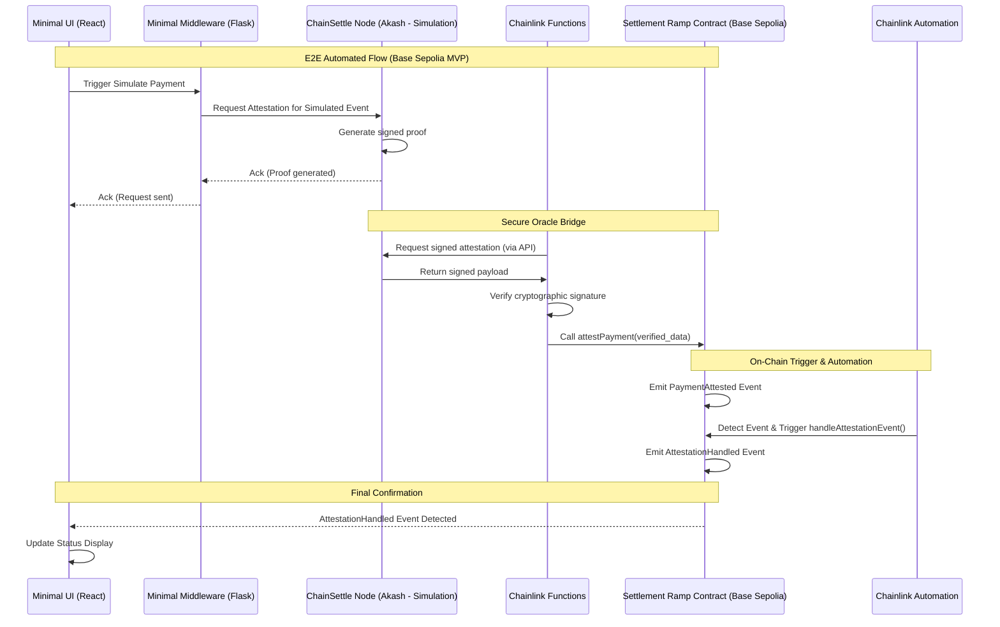

# Settlement Ramp

**Automated On-Chain Settlement on Base Sepolia Triggered by Verified Off-Chain
Payments**

`<place-settlement-ramp-logo-here>`

## Core Focus: Automated On-Chain Reaction (Base Sepolia MVP)

Settlement Ramp is laser-focused on demonstrating the **automated triggering of
on-chain actions on Base Sepolia** based on verified off-chain payment
confirmations, simulating a relevant LATAM use case (**PayPal -> Virtual US
Account**). We achieve this through a robust, multi-layered oracle architecture:

1. **ChainSettle (Akash):** **Simulates** receiving confirmation of the target
   payment event and generates a cryptographic proof. Hosted on Akash.
2. **Chainlink Functions:** Cryptographically verifies the ChainSettle
   attestation proof off-chain via its decentralized network.
3. **Settlement Ramp Contract (Base Sepolia):** Receives the verified
   attestation on-chain from the trusted Chainlink oracle and emits
   `PaymentAttested`.
4. **Chainlink Automation:** Listens for `PaymentAttested` on Base Sepolia and
   automatically triggers `handleAttestationEvent`.
5. **Minimal UI & Middleware:** A basic UI initiates the flow via a simple
   middleware, providing visual confirmation of the E2E automation.

This integrated system provides a trust-minimized pathway for automating
on-chain logic based on verified external events, demonstrated end-to-end on
Base Sepolia.

## Technical Architecture: A Multi-Layered Bridge (Base Sepolia MVP)

Our architecture combines specialized, decentralized components for security and
reliability:

1. **ChainSettle Node (Akash - Simulation)**:
   - **Simulates** receiving confirmation data representing USD arriving in a
     virtual US account (contextually, like one provided by Lulubit), with the
     original source being PayPal. _(Simulation is necessary due to current
     LATAM API limitations preventing direct integration within the MVP scope.)_
   - Generates cryptographically signed attestations using its private key.
   - Exposed securely via an API endpoint hosted on the decentralized Akash
     Network.
2. **Chainlink Functions (Attestation Verification)**:
   - Acts as a secure, decentralized off-chain computation layer.
   - Retrieves the signed attestation data from the ChainSettle API endpoint.
   - Independently verifies the cryptographic signature using ChainSettle's
     known public key.
   - If valid, calls the `Settlement Ramp` contract on Base Sepolia, passing the
     verified attestation data.
3. **Settlement Ramp Contract (Base Sepolia)**:
   - A minimal, focused smart contract deployed on Base Sepolia.
   - Receives calls strictly from the authorized Chainlink Functions oracle
     address.
   - Upon receiving verified data via `attestPayment`, emits `PaymentAttested`.
   - Includes `handleAttestationEvent` triggered _only_ by Chainlink Automation.
4. **Chainlink Automation (Event Listener & Trigger)**:
   - An Upkeep registered on the Chainlink Automation network for Base Sepolia.
   - Monitors the `PaymentAttested` event.
   - Automatically triggers `handleAttestationEvent` upon detection.
5. **Minimal UI (React/Tailwind/Vite) & Middleware (Python/Flask)**:
   - UI provides a button to trigger the flow.
   - Middleware receives the UI trigger, calls the ChainSettle Akash API, and
     returns.
   - UI listens for the final `AttestationHandled` event on Base Sepolia for
     status updates.



## Security Model: Defense in Depth

Our layered architecture provides robust security guarantees for the bridging
mechanism:

1. **Attestation Integrity (ChainSettle on Akash):** Ensures generation and
   signing occur within the controlled ChainSettle node environment. The
   cryptographic proof is real.
2. **Cryptographic Proof Verification (Chainlink Functions):** Decentralized
   verification of the attestation's authenticity _before_ hitting the
   blockchain.
3. **On-Chain Authorization (Settlement Ramp Contract):** Contract enforces that
   only the authorized Chainlink Functions oracle can call `attestPayment`.
4. **Automated Reaction Security (Chainlink Automation):** Ensures the follow-up
   action (`handleAttestationEvent`) is triggered reliably and decentrally
   _only_ upon the verified `PaymentAttested` event.

## Implementation Highlights (MVP)

### 1. ChainSettle Simulation Trigger (Akash)

- A specific API endpoint or modified CLI command on the Akash node simulates
  the "PayPal -> Virtual Account" confirmation and generates the signed JSON
  proof upon request.

### 2. Chainlink Functions Script

- JavaScript using **viem** to call the ChainSettle Akash API, perform
  `verifyMessage`, and encode the call to `attestPayment`.

```javascript
// Conceptual Chainlink Functions Script Snippet
import { createPublicClient, hashMessage, http, recoverAddress } from "viem";
// ... (setup Functions, secrets for API_URL, AUTH_TOKEN, PUBLIC_KEY)

// Fetch from ChainSettle API
const response = await Functions.makeHttpRequest({
  /* ... call Akash API ... */
});
const signedPayload = response.data; // Assuming JSON { data: {...}, signature: "0x..." }

// Verify Signature
const expectedSigner = secrets.CHAINSETTLE_PUBLIC_KEY;
const messageHash = hashMessage(
  JSON.stringify(signedPayload.data),
); // Or precise hashing used by ChainSettle
const recoveredAddress = recoverAddress({
  hash: messageHash,
  signature: signedPayload.signature,
});

if (recoveredAddress.toLowerCase() !== expectedSigner.toLowerCase()) {
  throw new Error("Invalid Signature");
}

// Encode call data for SettlementRamp.attestPayment(string)
const attestationJson = JSON.stringify(signedPayload.data); // Pass verified data
return Functions.encodeString(attestationJson);
```

### 3. Settlement Ramp Contract (Base Sepolia)

```solidity
// SPDX-License-Identifier: MIT
pragma solidity ^0.8.19;

contract SettlementRamp {
    address public immutable chainlinkFunctionsOracle;
    address public immutable chainlinkAutomationRegistry;

    event PaymentAttested(bytes32 indexed escrowId, address indexed merchant, uint256 amount, uint256 timestamp, string txRef);
    event AttestationHandled(bytes32 indexed escrowId, uint256 timestamp);

    mapping(bytes32 => bool) public isAttestationHandled;

    constructor(address _chainlinkFunctionsOracle, address _chainlinkAutomationRegistry) {
        chainlinkFunctionsOracle = _chainlinkFunctionsOracle;
        chainlinkAutomationRegistry = _chainlinkAutomationRegistry;
    }

    function attestPayment(string calldata attestationJson) external {
        require(msg.sender == chainlinkFunctionsOracle, "Not Functions Oracle");
        // Minimal data extraction/parsing for MVP
        bytes32 escrowId = keccak256(abi.encodePacked(attestationJson)); // Simple ID for MVP
        // Emit event with minimal/placeholder data
        emit PaymentAttested(escrowId, address(0), 0, block.timestamp, "sim_ref");
    }

    function handleAttestationEvent(bytes32 _escrowId) external {
        require(msg.sender == chainlinkAutomationRegistry, "Not Automation Registry");
        require(!isAttestationHandled[_escrowId], "Handled");
        isAttestationHandled[_escrowId] = true;
        // Minimal action: emit event
        emit AttestationHandled(_escrowId, block.timestamp);
    }
}
```

### 4. Chainlink Automation Upkeep Configuration (Base Sepolia)

- **Trigger:** Event `PaymentAttested(bytes32,address,uint256,uint256,string)`
- **Target:** `SettlementRamp` contract address on Base Sepolia.
- **Action:** Call `handleAttestationEvent(bytes32)`, mapping `escrowId` from
  event.

### 5. Minimal UI & Middleware

- **UI (React/Vite/Tailwind):**
  - Built with modern, lightweight stack using **viem** for blockchain
    interactions
  - **Key UI Components:**
    - `WalletConnection`: Uses wagmi + RainbowKit for seamless wallet connection
    - `EventListener`: Uses viem's `watchContractEvent` to monitor
      `AttestationHandled` events
    - `TriggerButton`: Calls middleware endpoint to initiate the flow
    - `StatusDisplay`: Shows current state of attestation flow

  ```javascript
  // Example: Event Listening with viem
  import { createPublicClient, http, parseAbiItem } from "viem";
  import { baseSepolia } from "viem/chains";

  // Set up client for Base Sepolia
  const client = createPublicClient({
    chain: baseSepolia,
    transport: http(),
  });

  // Listen for AttestationHandled events
  const unwatch = client.watchContractEvent({
    address: "YOUR_CONTRACT_ADDRESS",
    event: parseAbiItem(
      "event AttestationHandled(bytes32 indexed escrowId, uint256 timestamp)",
    ),
    onLogs: (logs) => {
      console.log("Event detected!", logs);
      // Update UI status
    },
  });
  ```

- **Middleware (Flask):**
  - Single endpoint `/trigger-attestation` receives POST from UI, calls
    ChainSettle Akash API (using env vars for secrets), returns HTTP 200.

## Getting Started

### Prerequisites

- **ChainSettle Node:** Running instance on Akash with simulation logic, API
  endpoint, and **Base Sepolia** wallet configured.
- **Chainlink Functions Subscription:** Active subscription for **Base Sepolia**
  funded with LINK.
- **Chainlink Automation Upkeep:** Registered Upkeep for **Base Sepolia** funded
  with LINK.
- **Base Sepolia Account:** Wallet with private key funded with Base Sepolia
  ETH.
- **pnpm:** Node.js package manager (`npm install -g pnpm`).
- **Foundry:** Smart contract toolkit
  (`curl -L https://foundry.paradigm.xyz | bash` then `foundryup`).
- **Python 3 & uv:** For the Flask middleware. Install uv with
  `curl -sSf https://astral.sh/uv/install.sh | bash`.

### Deployment Steps

1. **Deploy ChainSettle Node to Akash:** Follow guides, implement simulation
   trigger, secure API, configure Base Sepolia wallet. Note API URL & Auth
   details.
2. **Deploy Settlement Ramp Contract to Base Sepolia:**
   - Update deployment script (`scripts/DeploySettlementRamp.s.sol`) with
     correct Chainlink Functions Oracle and Automation Registry addresses for
     **Base Sepolia**.
   - Set `DEPLOYER_PRIVATE_KEY` and `BASE_SEPOLIA_RPC_URL` in `.env`.
   - Run:
     `pnpm forge script scripts/DeploySettlementRamp.s.sol:DeployScript --rpc-url $BASE_SEPOLIA_RPC_URL --private-key $DEPLOYER_PRIVATE_KEY --broadcast --verify --verifier basescan --verifier-url https://api-sepolia.basescan.org/api`
   - Note the deployed contract address on Base Sepolia.
3. **Configure & Deploy Chainlink Function (Base Sepolia):**
   - Set secrets (`CHAINSETTLE_API_URL`, `CHAINSETTLE_AUTH_TOKEN`,
     `CHAINSETTLE_PUBLIC_KEY`) in `.env`.
   - Create secrets on Chainlink Functions UI for Base Sepolia.
   - Deploy script using Chainlink toolkit, targeting **Base Sepolia**.
   - Add your Base Sepolia contract address as an authorized consumer to your
     Functions subscription.
4. **Register Chainlink Automation Upkeep (Base Sepolia):**
   - Use the Chainlink Automation App, selecting **Base Sepolia**.
   - Register Upkeep (Custom logic -> Event trigger).
   - Enter Base Sepolia contract address & `PaymentAttested` event signature.
   - Configure action to call `handleAttestationEvent(bytes32)`, mapping
     `escrowId`.
   - Fund the Upkeep with LINK.
5. **Run Middleware & UI:**
   - Configure middleware (`.env` with Akash API details).
   - Install middleware dependencies:
     `cd middleware && uv pip install -r requirements.txt`.
   - Run Flask server: `python app.py`.
   - Configure UI (`.env` with middleware URL, Base Sepolia contract address).
     Run Vite dev server (`pnpm dev`).

### Running the Automated Flow (Base Sepolia)

1. Ensure all components are deployed, configured, and funded on **Base
   Sepolia**.
2. Open the Minimal UI in your browser. Connect wallet (ensure network is Base
   Sepolia).
3. Click the "Simulate Payment & Attest" button.
4. **Monitor:**
   - UI status updates ("Requesting..." -> "Waiting..." -> "Handled!").
   - Middleware logs confirming call to Akash.
   - ChainSettle node logs (if accessible) confirming simulation & signing.
   - Chainlink Functions UI for request execution on Base Sepolia.
   - **Base Sepolia Scan** for the incoming transaction to `attestPayment`.
   - **Base Sepolia Scan** for the `PaymentAttested` event.
   - Chainlink Automation UI for the Upkeep performing on Base Sepolia.
   - **Base Sepolia Scan** for the incoming transaction to
     `handleAttestationEvent`.
   - **Base Sepolia Scan** for the `AttestationHandled` event.
   - UI displaying final "Attestation Handled!" status with link to the handling
     transaction on Base Sepolia Scan.

## Demo & Validation

- **Proof:** Successful E2E execution demonstrated via **Base Sepolia Scan**
  links for `attestPayment` tx, `PaymentAttested` event,
  `handleAttestationEvent` tx, and `AttestationHandled` event.
- **Video:** [Watch the 1-2 minute demo video](https://youtu.be/demo-link)
  _(Placeholder)_

## Future Roadmap (Post-Hackathon)

- **Real LATAM Integrations:** Replace simulation with live data sources
  relevant to LATAM.
- **Robust Data Handling:** Implement proper data parsing/encoding.
- **USDC Settlement Logic:** Add actual stablecoin transfer capabilities.
- **Merchant Configuration:** Allow user-defined parameters.
- **Gas Abstraction:** Explore sponsoring costs.

## Acknowledgments

- Directly leverages and adapts the
  **[ChainSettle](https://github.com/BrandynHamilton/chainsettle)** oracle
  system and its attestation framework, created by Brandyn Hamilton.
- Utilizes **Akash Network** for decentralized hosting of the ChainSettle node.
- Powered by **Chainlink Functions** & **Chainlink Automation**.
- Built on **Base Sepolia** for this MVP.
