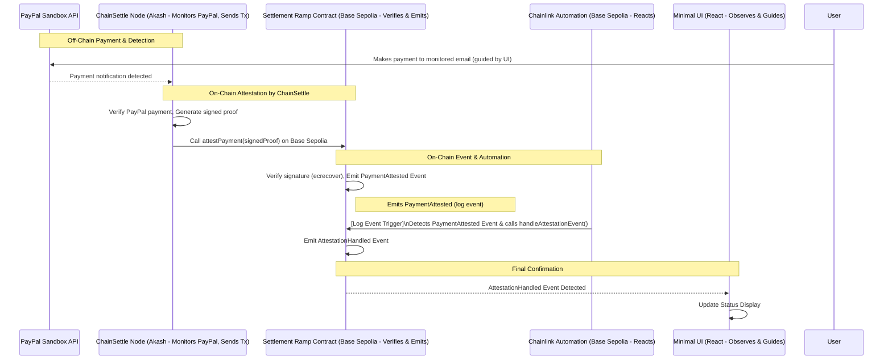

# Settlement Ramp

**Automated On-Chain Settlement on Base Sepolia Triggered by Verified PayPal
Payments**


Across Latin America (LATAM), individuals and businesses face significant
hurdles in accessing and utilizing global digital payments. Traditional systems
like PayPal, while widely used for receiving USD, present a labyrinth of high
fees, delays, and complexities when converting to local currency or on-chain
stablecoins. This friction blocks access to DeFi, global crypto commerce, and
efficient treasury management, hindering economic empowerment for a
digitally-savvy population.

**Settlement Ramp** is an MVP built for the Base Batches Hackathon (Stablecoins
Track) to tackle this challenge. It serves as a foundational engine for the
broader **Equilibrio** vision—an open, modular platform aiming to seamlessly
connect LATAM's payment rails with the on-chain world. As part of the Equilibrio
vision, we also plan to support modern, composable payment protocols such as
[x402](https://www.x402.org/) to further enhance programmability and developer
experience.

This project demonstrates a secure, automated bridge:

- **Off-Chain Trigger:** A simulated PayPal Sandbox payment is detected by the
  ChainSettle oracle system (deployed on Akash).
- **On-Chain Attestation & Verification (Base Sepolia):** ChainSettle submits a
  signed attestation to the `SettlementRamp` smart contract, which verifies its
  authenticity.
- **Automated Reaction:** Upon successful verification, the contract emits an
  event that triggers Chainlink Automation.
- **Guided Observation:** A minimal UI helps users initiate the PayPal Sandbox
  payment and observe the final on-chain confirmation.

Essentially, Settlement Ramp showcases a trust-minimized pipeline from an
off-chain payment to an actionable on-chain event on Base Sepolia, paving the
way for more accessible and efficient financial infrastructure.

---

## Technical Architecture: Event-Driven Automation on Base Sepolia

The Settlement Ramp architecture employs an event-driven automation pattern:

1. **Off-Chain Payment Detection:** The ChainSettle oracle system (on Akash)
   monitors a configured PayPal Sandbox account for payment confirmations.
2. **On-Chain Attestation:** Upon detecting a payment, ChainSettle generates a
   signed attestation and calls the `attestPayment` function in the
   `SettlementRamp` smart contract on Base Sepolia.
3. **Signature Verification & Event Emission:** The `SettlementRamp` contract
   verifies ChainSettle's signature using `ecrecover`. If valid, it emits a
   `PaymentAttested` event.
4. **Automated On-Chain Action:** Chainlink Automation, configured with a log
   event trigger, detects the `PaymentAttested` event and calls the
   `handleAttestationEvent` function in the `SettlementRamp` contract. This
   function then emits an `AttestationHandled` event.
5. **UI Observation:** A minimal UI guides the user through initiating the
   PayPal Sandbox payment and displays the final on-chain confirmation by
   listening for the `AttestationHandled` event.

This flow demonstrates a lean, end-to-end bridge from an off-chain trigger to an
automated on-chain response.

### Sequence Diagram



## Security Model: Implementation Integrity

The security of this MVP relies on several key aspects:

- **Attestation Origin:** The ChainSettle node (on Akash) uses its private key
  to sign attestations for PayPal Sandbox payments, ensuring a controlled and
  verifiable origin.
- **On-Chain Signature Verification:** The `SettlementRamp` contract uses
  `ecrecover` to cryptographically verify that attestations are genuinely signed
  by the authorized ChainSettle node.
- **Authorized Contract Callers:** Smart contract modifiers restrict
  `attestPayment` calls to the ChainSettle node and `handleAttestationEvent`
  calls to the Chainlink Automation Registry.
- **Reliable Event Reaction:** Chainlink Automation offers a decentralized and
  tamper-resistant mechanism for responding to the verified `PaymentAttested`
  event.

## Implementation Highlights (Base Sepolia)

### 1. ChainSettle Node (Akash) - PayPal Sandbox Integration & Tx Submission

- Configured with PayPal Sandbox API credentials to monitor a specific recipient
  email.
- Upon detecting a payment, it constructs a message with payment details (e.g.,
  `escrowId`, amount, PayPal `txRef`), signs it using its private key (EIP-191
  standard recommended), and then uses a library (like `web3.py` or `viem`) to
  send a raw transaction calling `attestPayment(...)` with all necessary
  arguments (including the signature) on the Base Sepolia contract.

### 2. Settlement Ramp Contract (Base Sepolia) - Signature Verification

```solidity
// SPDX-License-Identifier: MIT
pragma solidity ^0.8.19;

contract SettlementRamp {
    address public immutable chainSettleNodeAddress; // Authorized attester from Akash
    address public immutable chainlinkAutomationRegistry; // Base Sepolia Automation Registry

    event PaymentAttested(bytes32 indexed escrowId, address indexed payerSim, uint256 amountSim, uint256 timestamp, string txRefPayPalSim);
    event AttestationHandled(bytes32 indexed escrowId, uint256 timestamp);

    mapping(bytes32 => bool) public isAttestationHandled;

    constructor(address _chainSettleNodeAddress, address _chainlinkAutomationRegistry_baseSepolia) {
        chainSettleNodeAddress = _chainSettleNodeAddress; // Wallet address ChainSettle uses to send tx
        chainlinkAutomationRegistry = _chainlinkAutomationRegistry_baseSepolia;
    }

    modifier onlyChainSettleNode() {
        require(msg.sender == chainSettleNodeAddress, "Caller is not ChainSettle node");
        _;
    }

    modifier onlyAutomationRegistry() {
        require(msg.sender == chainlinkAutomationRegistry, "Caller is not Automation Registry");
        _;
    }

    // Called directly by the ChainSettle node on Akash
    function attestPayment(
        bytes32 _escrowId,         // Unique ID for the attestation
        address _payerSim,         // Simulated payer address from PayPal data
        uint256 _amountSim,        // Amount from PayPal data
        string calldata _txRefPayPalSim, // PayPal Transaction ID
        bytes calldata _signature  // Signature from ChainSettle node over hash of other params
    ) external onlyChainSettleNode {
        // Reconstruct the message hash exactly as ChainSettle signed it
        bytes32 messageHash = keccak256(abi.encodePacked(_escrowId, _payerSim, _amountSim, _txRefPayPalSim));
        // Apply EIP-191 prefix: "\x19Ethereum Signed Message:\n" + message length (32 bytes for hash)
        bytes32 prefixedHash = keccak256(abi.encodePacked("\x19Ethereum Signed Message:\n32", messageHash));

        // Verify the signature against the hash and the known ChainSettle node address
        address signer = recoverSigner(prefixedHash, _signature);
        require(signer == chainSettleNodeAddress, "Invalid signature from ChainSettle");

        // If signature is valid, emit the event
        emit PaymentAttested(_escrowId, _payerSim, _amountSim, block.timestamp, _txRefPayPalSim);
    }

    // Called by Chainlink Automation on Base Sepolia
    function handleAttestationEvent(bytes32 _escrowId) external onlyAutomationRegistry {
        require(!isAttestationHandled[_escrowId], "Attestation already handled");
        isAttestationHandled[_escrowId] = true;
        // Minimal action for MVP: emit event. Future: trigger USDC settlement.
        emit AttestationHandled(_escrowId, block.timestamp);
    }

    // Helper function to recover signer address from signature
    function recoverSigner(bytes32 _hash, bytes calldata _signature)
        internal pure returns (address)
    {
        bytes32 r;
        bytes32 s;
        uint8 v;
        // Check signature length (must be 65 bytes)
        if (_signature.length != 65) {
            return address(0);
        }
        // Extract signature components (r, s, v)
        assembly {
            r := mload(add(_signature, 32))
            s := mload(add(_signature, 64))
            v := byte(0, mload(add(_signature, 96))) // Use 96 for v if r,s are 32 bytes each
        }
        // Adjust v value for older Ledger signing standard if necessary (usually 27 or 28)
        if (v < 27) {
            v += 27;
        }
        // Ensure v is either 27 or 28
        if (v != 27 && v != 28) {
            return address(0);
        }
        // Use ecrecover precompile to recover the signer's address
        return ecrecover(_hash, v, r, s);
    }
}
```

### 3. Chainlink Automation Upkeep Configuration (Base Sepolia)

- **Trigger:** Event `PaymentAttested(bytes32,address,uint256,uint256,string)`
- **Target:** `SettlementRamp` contract address on Base Sepolia.
- **Action:** Call `handleAttestationEvent(bytes32)`, mapping `escrowId` from
  the event.

### 4. Minimal UI (React/Vite/Tailwind)

- Provides instructions: "1. Send payment via PayPal Sandbox to
  `[monitored_email]`. 2. Wait for confirmation below."
- Connects wallet (using OnchainKit, wagmi/RainbowKit for Base Sepolia).
- Listens for `AttestationHandled` event using `viem watchContractEvent` on Base
  Sepolia.
- Displays status: "Waiting for PayPal Sandbox Payment..." -> "Payment Attested
  on Base Sepolia, Awaiting Automation..." -> "Attestation Handled! Tx:
  [SepoliaScan link]".

## Getting Started (for Base Sepolia)

### Prerequisites

- **ChainSettle Node (on Akash):**
  - Running instance configured with **PayPal Sandbox API credentials**.
  - Monitors a specific **PayPal Sandbox recipient email address**.
  - Wallet funded with **Base Sepolia ETH** to send `attestPayment`
    transactions. Note this wallet's address (`chainSettleNodeAddress`).
- **PayPal Sandbox Account:** To send test payments to the monitored email.
- **Chainlink Automation Upkeep (Base Sepolia):** Registered and funded with
  LINK for event-based triggering.
- **Base Sepolia Account:** Wallet with private key for deploying the contract.
- **Development Tools:**
  - pnpm (package manager)
  - Foundry (for smart contract development)
  - Node.js (for frontend development)

### Installation

1. Clone the repository:
   ```bash
   git clone https://github.com/tapilew/settlement-ramp.git
   cd settlement-ramp
   ```
2. Install dependencies:
   ```bash
   pnpm install
   ```
3. Set up environment variables:
   ```bash
   cp .env.example .env
   # Edit .env with your configuration
   ```

### Deployment Steps (All for Base Sepolia)

1. **Deploy & Configure ChainSettle Node to Akash:**
   - Implement PayPal Sandbox monitoring and transaction submission logic
     (signing message, sending raw tx).
   - Note the Base Sepolia wallet address the node uses
     (`chainSettleNodeAddress`).
2. **Deploy Settlement Ramp Contract to Base Sepolia:**
   - Update constructor arguments in deployment script
     (`scripts/DeploySettlementRamp.s.sol`) with the `chainSettleNodeAddress`
     and the correct **Chainlink Automation Registry address for Base Sepolia**.
   - Set `DEPLOYER_PRIVATE_KEY` and `BASE_SEPOLIA_RPC_URL` in `.env`.
   - Run:
     ```bash
     pnpm forge script scripts/DeploySettlementRamp.s.sol:DeployScript --rpc-url $BASE_SEPOLIA_RPC_URL --private-key $DEPLOYER_PRIVATE_KEY --broadcast --verify --verifier basescan --verifier-url https://api-sepolia.basescan.org/api
     ```
   - Note deployed contract address.
3. **Register Chainlink Automation Upkeep (Base Sepolia):**
   - Use Chainlink Automation App for Base Sepolia.
   - Configure Event trigger for `PaymentAttested` on your contract.
   - Map the `escrowId` from the event to the `handleAttestationEvent` function
     parameter.
   - Fund the upkeep with LINK tokens.
4. **Set Up Basename (Optional for improved UX):**
   - Register a Basename for your project at
     [base.org/names](https://www.base.org/names).
   - Configure OnchainKit to use your Basename in the UI.
5. **Run UI:**
   - Configure UI (`.env` with Base Sepolia contract address and RPC URL).
   - Start development server:
     ```bash
     pnpm dev
     ```

### Running the Automated Flow (on Base Sepolia)

1. **Make a PayPal Sandbox Payment:** Send payment to the email monitored by
   ChainSettle. Note any reference ID.
2. **Observe ChainSettle:** Node detects payment, verifies, signs, and sends
   transaction calling `attestPayment` on Base Sepolia.
3. **Monitor Base Sepolia Scan & UI:**
   - Transaction from ChainSettle node calling `attestPayment`.
   - `PaymentAttested` event.
   - Chainlink Automation Upkeep triggers on event detection.
   - Transaction from Automation Registry calling `handleAttestationEvent`.
   - `AttestationHandled` event.
   - UI updates status to "Attestation Handled!" with transaction link.

## Demo & Validation (Base Sepolia)

- **Proof:** Successful E2E execution via **Base Sepolia Explorer**
  (`https://sepolia.basescan.org/`) links for all on-chain steps.
- **Video:** [Watch the 1-2 minute demo video](https://example.com)
  _(Placeholder - shows PayPal Sandbox payment -> automated Base Sepolia flow ->
  UI update)_

## Future Roadmap: Towards Equilibrio

This Settlement Ramp MVP validates a core payment primitive. The broader
Equilibrio vision includes:

- **Live & Localized Payments:**
  - Integrate live PayPal APIs.
  - Support actual LATAM local payment methods (e.g., Yappy, PSE, Nequi).
- **Full USDC Settlement:** Implement automated USDC conversion and transfer on
  Base mainnet.
- **Fintech & Exchange Enablement:** Develop SDKs and tools for third-party
  integration.
- **Off-Ramp Capabilities:** Design and build the reverse flow for fiat payouts.
- **Protocol Enhancements:**
  - Integrate the [x402 protocol](https://www.x402.org/) for HTTP-native,
    blockchain-agnostic payments.
- **Developer & User Experience:**
  - Enhance UI/UX with OnchainKit components.
  - Integrate Basenames for human-readable addresses.
- **Production Readiness:** Implement robust data parsing, error handling, and
  enhanced security.

## Acknowledgments

- This project, **Settlement Ramp**, heavily features and showcases the
  **ChainSettle oracle system**
  ([GitHub](https://github.com/BrandynHamilton/chainsettle)) by Brandyn
  Hamilton, deployed on **Akash Network**, as the core technology for off-chain
  event attestation and on-chain transaction initiation.
- Utilizes **Chainlink Automation** for reliable on-chain event triggering on
  **Base Sepolia**.
- Built on **Base Sepolia** for the Base Batches Buildathon (Stablecoins Track).
- Leverages **PayPal Sandbox** for realistic off-chain payment event
  demonstration.
- Part of the broader **Equilibrio** ecosystem
  ([GitHub](https://github.com/tapilew/equilibrio-alpha)) focused on building
  composable financial infrastructure for LATAM.
- Integrates with **OnchainKit** for optimized Base development and plans to use
  **Basenames** for enhanced user experience.
