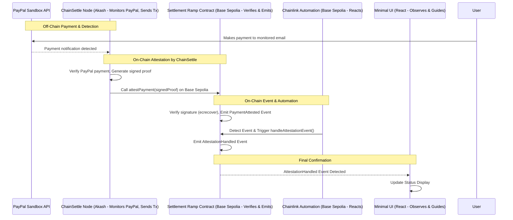

# Settlement Ramp

**Automated On-Chain Settlement on Base Sepolia Triggered by Verified PayPal
Sandbox Payments**

## The Problem: LATAM's Crippling On-Ramp Friction & The "PayPal Prison"

For countless freelancers, small to medium-sized businesses (SMBs), and
individuals across Latin America (LATAM), PayPal serves as a common gateway for
receiving international USD payments. However, a significant problem emerges
when they attempt to utilize these funds effectively:

- **The "PayPal Prison":** While USD lands in their PayPal accounts, moving
  these funds into local circulation or, critically, into on-chain stablecoins
  like USDC on efficient blockchains such as Base, is often a nightmare.
- **Exorbitant Fees:** Users can lose a substantial portion (e.g., 10-15% or
  more) through multiple conversion steps, unfavorable exchange rates, and high
  transaction fees from intermediary services.
- **Crippling Delays:** Transfers can take days, not minutes, hindering cash
  flow, business agility, and the ability to react to market opportunities.
- **Opaque & Complex Processes:** Navigating the web of services required for
  these conversions is confusing and time-consuming.
- **Lack of Modern Infrastructure:** The absence of "Stripe-like" seamless
  payment infrastructure in many LATAM countries exacerbates these issues,
  leaving users with fragmented and inefficient options.

This friction effectively traps funds and blocks LATAM users from fully
participating in global digital commerce, accessing DeFi opportunities, or
managing their treasuries efficiently with stablecoins on modern blockchains
like Base.

## Our Solution for this MVP: Settlement Ramp - A Verifiable Bridge from PayPal to Base Sepolia

This MVP showcases **Settlement Ramp**, a system built to demonstrate a direct
solution to automating the _next step_ after a PayPal payment is confirmed. We
leverage the **ChainSettle oracle system (deployed on Akash)** to create a
secure, automated bridge.

Specifically, this project demonstrates how a **payment confirmation within the
PayPal Sandbox environment** (simulating a LATAM user receiving an international
USD payment) can verifiably trigger immediate, programmable actions on **Base
Sepolia**.

The core innovation is the **trust-minimized, automated pipeline** from an
off-chain fiat rail confirmation (PayPal Sandbox) to an actionable on-chain
event, with subsequent automated handling.

**Immediate Value & Foundational Infrastructure:**

For this hackathon, we prove the technical feasibility of this critical bridge.
This infrastructure is a **foundational building block** for more comprehensive
financial tools aimed at solving LATAM's payment fragmentation (aligning with
the broader vision of systems like
[Equilibrio](https://github.com/tapilew/equilibrio-alpha)). By automating the
on-chain reaction to off-chain payments, we pave the way for solutions that can
significantly reduce fees, eliminate delays, and bring transparency to
on-ramping USD (via PayPal) to **USDC on Base** for LATAM users.

## Technical Architecture: A Lean, Focused Bridge (Base Sepolia MVP)

Our architecture for this MVP is streamlined to showcase the core E2E flow:

1. **ChainSettle Node (Akash - PayPal Sandbox Integration)**:
   - The core off-chain component. It integrates directly with the **PayPal
     Sandbox API** to monitor a configured recipient email address for payment
     confirmations.
   - Upon detecting a payment, ChainSettle verifies it and **generates a
     cryptographic attestation (a signed proof)** containing key payment
     details.
   - Crucially, the ChainSettle node then **itself initiates an on-chain
     transaction**, calling the `SettlementRamp` contract on Base Sepolia with
     this signed proof.
2. **Settlement Ramp Contract (Base Sepolia)**:
   - A lean smart contract on Base Sepolia acting as the **on-chain verifier and
     event emitter.**
   - Its `attestPayment` function receives the signed proof from the trusted
     ChainSettle node address (enforced by a modifier) and **verifies the
     signature using `ecrecover`**. This confirms the attestation's authenticity
     as originating from ChainSettle.
   - If valid, it emits `PaymentAttested`, making the verified off-chain event
     available for on-chain automation.
   - Includes `handleAttestationEvent` triggered _only_ by Chainlink Automation.
3. **Chainlink Automation (Event Listener & Trigger - Base Sepolia)**:
   - Provides the decentralized, reliable mechanism to react to the
     `PaymentAttested` event.
   - An Upkeep registered on the Chainlink Automation network for Base Sepolia
     monitors the `SettlementRamp` contract.
   - Automatically calls `handleAttestationEvent` upon detection of the
     `PaymentAttested` event.
4. **Minimal UI (React/Vite/Tailwind)**:
   - A simple UI allows users to understand the flow. It provides instructions
     on how to trigger a payment in the PayPal Sandbox (to the email monitored
     by ChainSettle).
   - It then connects to Base Sepolia (via wagmi/viem) to listen for the final
     `AttestationHandled` event and display confirmation.
   - The trigger is the PayPal Sandbox payment itself, detected by ChainSettle.



## Security Model: Focused on MVP Integrity

1. **Attestation Origin (ChainSettle on Akash):** ChainSettle's integration with
   PayPal Sandbox and its private key for signing ensure the attestation
   originates from a controlled source reflecting a (Sandbox) payment.
2. **On-Chain Signature Verification (`ecrecover`):** The `SettlementRamp`
   contract cryptographically verifies that the attestation was indeed signed by
   the known ChainSettle node, ensuring authenticity of the data submitted
   on-chain.
3. **Authorized Callers:** The contract uses modifiers to ensure `attestPayment`
   is only callable by the ChainSettle node and `handleAttestationEvent` only by
   the Chainlink Automation Registry.
4. **Decentralized Event Reaction (Chainlink Automation):** Provides a reliable
   and tamper-resistant way to act upon the verified on-chain event.

## Implementation Highlights (MVP for Base Sepolia)

### 1. ChainSettle Node (Akash) - PayPal Sandbox Integration & Tx Submission

- Configured with PayPal Sandbox API credentials to monitor a specific recipient
  email.
- Upon detecting a payment, it constructs a message with payment details (e.g.,
  `escrowId`, amount, PayPal `txRef`), signs it using its private key, and then
  uses a library (like `web3.py` or `ethers.js` within its Python/Node.js
  environment) to send a raw transaction calling `attestPayment(signedProof)` on
  the Base Sepolia contract.

### 2. Settlement Ramp Contract (Base Sepolia) - Signature Verification

```solidity
// SPDX-License-Identifier: MIT
pragma solidity ^0.8.19;

contract SettlementRamp {
    address public immutable chainSettleNodeAddress; // Authorized attester
    address public immutable chainlinkAutomationRegistry;

    event PaymentAttested(bytes32 indexed escrowId, address indexed payerSim, uint256 amountSim, uint256 timestamp, string txRefPayPalSim);
    event AttestationHandled(bytes32 indexed escrowId, uint256 timestamp);

    mapping(bytes32 => bool) public isAttestationHandled;

    // Store ChainSettle's public key (or derive from a known address if preferred)
    // For simplicity, we assume chainSettleNodeAddress IS the signer.
    // In a more complex setup, you might store a separate public key.

    constructor(address _chainSettleNodeAddress, address _chainlinkAutomationRegistry_baseSepolia) {
        chainSettleNodeAddress = _chainSettleNodeAddress; // Wallet address ChainSettle uses to send tx
        chainlinkAutomationRegistry = _chainlinkAutomationRegistry_baseSepolia;
    }

    modifier onlyChainSettleNode() {
        require(msg.sender == chainSettleNodeAddress, "Caller is not ChainSettle node");
        _;
    }

    modifier onlyAutomationRegistry() {
        require(msg.sender == chainlinkAutomationRegistry, "Caller is not Automation Registry");
        _;
    }

    // Called by ChainSettle node on Akash
    function attestPayment(
        bytes32 _escrowId,         // Unique ID for the attestation
        address _payerSim,         // Simulated payer address from PayPal data
        uint256 _amountSim,        // Amount from PayPal data
        string calldata _txRefPayPalSim, // PayPal Transaction ID
        bytes calldata _signature      // Signature from ChainSettle node
    ) external onlyChainSettleNode {
        bytes32 messageHash = keccak256(abi.encodePacked(_escrowId, _payerSim, _amountSim, _txRefPayPalSim));
        // EIP-191 prefix: "\x19Ethereum Signed Message:\n" + message length
        bytes32 prefixedHash = keccak256(abi.encodePacked("\x19Ethereum Signed Message:\n32", messageHash));

        address signer = recoverSigner(prefixedHash, _signature);
        require(signer == chainSettleNodeAddress, "Invalid signature from ChainSettle");

        emit PaymentAttested(_escrowId, _payerSim, _amountSim, block.timestamp, _txRefPayPalSim);
    }

    function handleAttestationEvent(bytes32 _escrowId) external onlyAutomationRegistry {
        require(!isAttestationHandled[_escrowId], "Attestation already handled");
        isAttestationHandled[_escrowId] = true;
        emit AttestationHandled(_escrowId, block.timestamp);
    }

    function recoverSigner(bytes32 _hash, bytes calldata _signature)
        internal pure returns (address)
    {
        bytes32 r;
        bytes32 s;
        uint8 v;
        if (_signature.length != 65) {
            return address(0);
        }
        assembly {
            r := mload(add(_signature, 32))
            s := mload(add(_signature, 64))
            v := byte(0, mload(add(_signature, 96)))
        }
        // EIP-2 still valid for v calculation
        if (v < 27) {
            v += 27;
        }
        if (v != 27 && v != 28) {
            return address(0);
        }
        return ecrecover(_hash, v, r, s);
    }
}
```

### 3. Chainlink Automation Upkeep Configuration (Base Sepolia)

- **Trigger:** Event `PaymentAttested(bytes32,address,uint256,uint256,string)`
- **Target:** `SettlementRamp` contract address on Base Sepolia.
- **Action:** Call `handleAttestationEvent(bytes32)`, mapping `escrowId` from
  event.

### 4. Minimal UI (React/Vite/Tailwind)

- Provides instructions to make a PayPal Sandbox payment.
- Connects wallet (wagmi/RainbowKit for Base Sepolia).
- Listens for `AttestationHandled` event using `viem watchContractEvent` on Base
  Sepolia.
- Displays status: "Waiting for PayPal Sandbox Payment..." -> "Payment Attested
  on Base Sepolia, Awaiting Automation..." -> "Attestation Handled! Tx:
  [SepoliaScan link]".

## Getting Started (for Base Sepolia MVP)

### Prerequisites

- **ChainSettle Node (on Akash):**
  - Running instance configured with **PayPal Sandbox API credentials**.
  - Monitors a specific **PayPal Sandbox recipient email address**.
  - Wallet funded with **Base Sepolia ETH** to send `attestPayment`
    transactions.
- **PayPal Sandbox Account:** To send test payments.
- **Chainlink Automation Upkeep (Base Sepolia):** Registered and funded with
  LINK.
- **Base Sepolia Account:** Wallet with private key for deploying the contract.
- **pnpm, Foundry, Python 3 & uv.**

### Deployment Steps (All for Base Sepolia)

1. **Deploy & Configure ChainSettle Node to Akash:**
   - Implement PayPal Sandbox monitoring and transaction submission logic.
   - Ensure its wallet address (used to send txns) is known for the
     `SettlementRamp` constructor.
2. **Deploy Settlement Ramp Contract to Base Sepolia:**
   - Update constructor arguments in deployment script
     (`scripts/DeploySettlementRamp.s.sol`) with the **ChainSettle Node's Base
     Sepolia address** and the correct **Chainlink Automation Registry address
     for Base Sepolia**.
   - Set `DEPLOYER_PRIVATE_KEY` and `BASE_SEPOLIA_RPC_URL` in `.env`.
   - Run:
     `forge script scripts/DeploySettlementRamp.s.sol:DeployScript --rpc-url $BASE_SEPOLIA_RPC_URL --private-key $DEPLOYER_PRIVATE_KEY --broadcast --verify --verifier basescan --verifier-url https://api-sepolia.basescan.org/api`
   - Note deployed contract address.
3. **Register Chainlink Automation Upkeep (Base Sepolia):**
   - Use Chainlink Automation App for Base Sepolia.
   - Configure Event trigger for `PaymentAttested` on your contract, calling
     `handleAttestationEvent(bytes32)`.
4. **Run UI:**
   - Configure UI (`.env` with Base Sepolia contract address and RPC URL). Run
     Vite dev server (`pnpm dev`).

### Running the Automated Flow (on Base Sepolia)

1. **Make a PayPal Sandbox Payment:** Send payment to the email monitored by
   ChainSettle. Include a unique reference if ChainSettle uses it to identify
   the specific payment to attest.
2. **Observe ChainSettle:** Node detects payment, verifies, signs, and sends
   transaction to `attestPayment` on Base Sepolia.
3. **Monitor Base Sepolia Scan & UI:**
   - Transaction from ChainSettle node calling `attestPayment`.
   - `PaymentAttested` event.
   - Chainlink Automation Upkeep triggers.
   - Transaction from Automation Registry calling `handleAttestationEvent`.
   - `AttestationHandled` event.
   - UI updates status to "Attestation Handled!" with transaction link.

## Demo & Validation (Base Sepolia)

- **Proof:** Successful E2E execution via **Base Sepolia Explorer**
  (`https://sepolia.base.org/`) links for all on-chain steps.
- **Video:** A demo video showcasing the PayPal Sandbox payment to automated
  Base Sepolia flow and UI update will be added here.

## Future Roadmap

This MVP proves the core automated bridge from PayPal Sandbox to Base Sepolia.
Future work:

- **Live PayPal Integration:** Transition to live PayPal APIs.
- **Direct USDC Settlement Logic:** Implement actual USDC transfers on Base
  (mainnet) triggered by `handleAttestationEvent`.
- **Broader LATAM Payment Rails:** Explore secure integrations with other
  relevant LATAM payment methods.
- **Enhanced Data & Security:** Robust parsing of payment data, comprehensive
  error handling.
- **User/Merchant Tools:** Develop interfaces for easier configuration and use.

## Acknowledgments

- This project heavily features and showcases the **ChainSettle oracle system**
  ([link to GitHub](https://github.com/BrandynHamilton/chainsettle)) by Brandyn
  Hamilton, deployed on **Akash Network**.
- Utilizes **Chainlink Automation** for reliable on-chain event triggering on
  **Base Sepolia**.
- Built on **Base Sepolia** for the Base Batches Buildathon (Stablecoins Track).
- Leverages **PayPal Sandbox** for realistic off-chain payment event
  demonstration.
