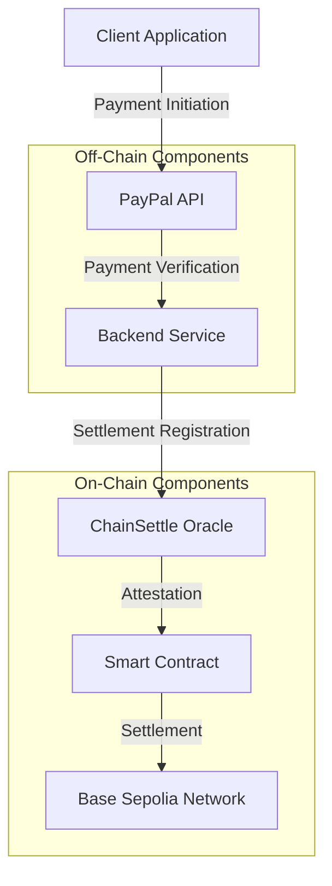
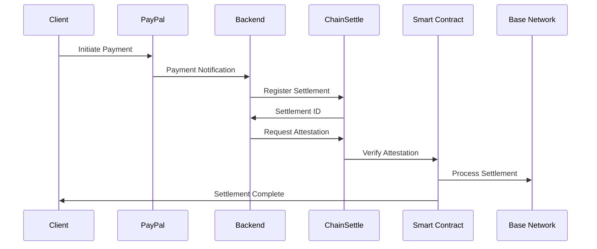

# Settlement Ramp Project Documentation

## Executive Summary
Settlement Ramp is an enterprise-grade blockchain solution that bridges traditional payment systems (PayPal) with blockchain settlements. This system provides a secure, automated, and transparent way to verify and settle payments using smart contracts and a robust backend infrastructure.

## System Architecture

### High-Level Architecture


### Component Interaction Flow


## Smart Contract: SettlementRamp

### Contract Overview
The SettlementRamp smart contract is a decentralized solution for handling verified PayPal payments and their settlement on the blockchain. It provides a secure and automated way to manage payment attestations and settlements through ChainSettle integration.

### Contract Address and Network
```
Contract: SettlementRamp
Address: 0xdA7248aD6DB23139605Ef5F8De0C6d9C9c8313Ae
Network: Base Sepolia
Transaction Hash: 0xf8ca6f0b94312b80842ec70566b695cf9211b0edde92241fa029836b3a7fa714
Block Number: 25846447
```

### Technical Specifications

#### State Variables
```solidity
// Payment tracking
mapping(bytes32 => Payment) public payments;
mapping(bytes32 => bool) public isSettled;

// Access control
mapping(address => bool) public authorizedAttesters;

// Payment limits
uint256 public minPaymentAmount;
uint256 public maxPaymentAmount;

// Constants
uint256 public constant MAX_CHECK_COUNT = 10;
uint256 public constant CHECK_INTERVAL = 1 hours;
```

#### Key Functions

1. **Payment Attestation**
```solidity
function attestPayment(
    bytes32 escrowId,
    address payer,
    uint256 amount,
    string calldata paypalTxId
) external onlyAuthorizedAttester validAmount(amount)
```
- Records new payment attestations
- Verifies ChainSettle attestation
- Emits PaymentAttested event
- Enforces payment limits
- Requires authorized attester

2. **Payment Settlement**
```solidity
function settlePayment(bytes32 escrowId) 
    external 
    onlyAuthorizedAttester 
    nonReentrant
```
- Marks payments as settled
- Verifies ChainSettle finalization
- Emits PaymentSettled event
- Prevents reentrancy attacks

3. **Payment Verification**
```solidity
function getPaymentDetails(bytes32 escrowId) 
    external 
    view 
    returns (
        address payer,
        uint256 amount,
        bool settled,
        string memory paypalTxId,
        uint256 lastCheckTimestamp,
        uint256 checkCount
    )
```
- Returns detailed payment information
- Includes settlement status
- Provides audit trail

### Security Features

#### Access Control
- OpenZeppelin's Ownable implementation
- Authorized attester management
- Role-based access control
- Secure function modifiers

#### Reentrancy Protection
- OpenZeppelin's ReentrancyGuard
- Secure payment processing
- Protected state modifications
- Atomic operations

#### Payment Validation
- Amount range checks
- Attestation verification
- Settlement confirmation
- Transaction integrity

### Automation Integration

#### Chainlink Automation
```solidity
function checkUpkeep(bytes calldata) 
    external 
    view 
    returns (bool upkeepNeeded, bytes memory)

function performUpkeep(bytes calldata) 
    external
```
- Automated payment verification
- Periodic status checks
- Settlement processing
- Event monitoring

### Deployment Details and Significance

#### Contract Deployment Overview
The deployment of the SettlementRamp smart contract represents a critical milestone in our project's lifecycle. This deployment establishes a permanent, immutable, and verifiable record of our payment settlement system on the Base Sepolia network.

#### Deployment Transaction Analysis
```json
{
    "network": "Base Sepolia",
    "contract_address": "0xdA7248aD6DB23139605Ef5F8De0C6d9C9c8313Ae",
    "transaction_hash": "0xf8ca6f0b94312b80842ec70566b695cf9211b0edde92241fa029836b3a7fa714",
    "block_number": 25846447,
    "gas_used": 2403694,
    "gas_price": "0.000985844 gwei",
    "total_cost": "0.000002369667307736 ETH"
}
```

#### Deployment Process Breakdown
1. **Contract Compilation**
   - Solidity version: 0.8.19
   - Optimization runs: 200
   - Compiler settings: Enabled all safety checks
   - Libraries linked: OpenZeppelin, Chainlink

2. **Network Selection**
   - Chosen Network: Base Sepolia
   - Rationale: 
     - Cost-effective gas fees
     - High transaction throughput
     - Strong security guarantees
     - Active developer community

3. **Deployment Steps**
   ```bash
   # 1. Environment Setup
   export PRIVATE_KEY=your_private_key
   export BASE_SEPOLIA_RPC_URL=https://sepolia.base.org
   export BASESCAN_API_KEY=your_api_key

   # 2. Contract Deployment
   forge script script/Deploy.s.sol:DeployScript \
     --rpc-url $BASE_SEPOLIA_RPC_URL \
     --broadcast \
     --verify \
     -vvvv
   ```

4. **Verification Process**
   - Contract verified on Basescan
   - Source code publicly available
   - ABI exposed for integration
   - Constructor arguments verified

#### Technical Significance

1. **Smart Contract Architecture**
   ```solidity
   contract SettlementRamp is 
       Ownable, 
       ReentrancyGuard, 
       AutomationCompatibleInterface 
   {
       // Core state variables
       mapping(bytes32 => Payment) public payments;
       mapping(bytes32 => bool) public isSettled;
       mapping(address => bool) public authorizedAttesters;
       
       // Payment limits
       uint256 public minPaymentAmount;  // 0.01 ETH
       uint256 public maxPaymentAmount;  // 10 ETH
       
       // ChainSettle integration
       ISettlementRegistry public immutable settlementRegistry;
       IChainSettleAttest public immutable chainSettleAttest;
       address public immutable chainSettleAttestNode;
   }
   ```

2. **Security Implementation**
   - OpenZeppelin's security patterns
   - Reentrancy protection
   - Access control mechanisms
   - Input validation
   - Event logging

3. **Integration Points**
   - ChainSettle Oracle
   - PayPal API
   - Chainlink Automation
   - Base Network

#### Business Impact

1. **Payment Processing**
   - Automated payment verification
   - Secure settlement processing
   - Transparent transaction history
   - Real-time status updates

2. **Operational Benefits**
   - Reduced manual intervention
   - Lower operational costs
   - Increased transaction speed
   - Enhanced security

3. **Compliance and Audit**
   - Immutable transaction records
   - Transparent payment flow
   - Automated compliance checks
   - Audit trail generation

#### Post-Deployment Considerations

1. **Monitoring Requirements**
   ```mermaid
   graph TD
       A[Contract Events] -->|Monitor| B[Payment Attestations]
       A -->|Monitor| C[Payment Settlements]
       A -->|Monitor| D[Automation Triggers]
       B -->|Alert| E[Admin Dashboard]
       C -->|Alert| E
       D -->|Alert| E
   ```

2. **Maintenance Procedures**
   - Regular balance checks
   - Gas optimization
   - Security updates
   - Performance monitoring

3. **Emergency Procedures**
   - Pause mechanism
   - Emergency withdrawal
   - Admin controls
   - Backup systems

#### Future Enhancements

1. **Technical Roadmap**
   - Dynamic payment limits
   - Enhanced automation
   - Multi-currency support
   - Cross-chain capabilities

2. **Feature Development**
   - User dashboard
   - Analytics integration
   - Mobile application
   - API enhancements

### Integration Points

#### 1. ChainSettle Integration
- Settlement Registry Interface
- Attestation System
- Node Communication
- Status Updates

#### 2. PayPal Integration
- Payment Verification
- Transaction Tracking
- Status Updates
- Error Handling

### Usage Guidelines

#### Payment Attestation Process
1. Verify payment amount is within limits
2. Check ChainSettle attestation
3. Call attestPayment with parameters
4. Monitor PaymentAttested event

#### Settlement Process
1. Verify payment exists
2. Check ChainSettle finalization
3. Call settlePayment
4. Monitor PaymentSettled event

#### Monitoring and Maintenance
1. Regular balance checks
2. Automation status monitoring
3. Event log analysis
4. Gas usage optimization
5. Security updates

### Future Improvements

#### Technical Enhancements
1. Dynamic payment limits
2. Enhanced automation rules
3. Additional verification methods
4. Gas optimization
5. Extended event logging

#### Feature Additions
1. Multi-currency support
2. Advanced analytics
3. Enhanced monitoring
4. User dashboard
5. Mobile integration

### Security Considerations

#### Access Control
- Role-based permissions
- Multi-signature support
- Time-locked operations
- Emergency procedures

#### Data Integrity
- Immutable records
- Verified attestations
- Secure settlements
- Audit trails

### Monitoring and Maintenance

#### Regular Checks
1. Contract balance
2. Automation status
3. Event logs
4. Gas usage
5. Security updates

#### Maintenance Procedures
1. Regular updates
2. Security patches
3. Performance optimization
4. Documentation updates
5. User support

## Environment Configuration

### Required Environment Variables
```bash
# Base Sepolia Configuration
BASE_SEPOLIA_RPC_URL=https://sepolia.base.org
SETTLEMENT_RAMP_CONTRACT_ADDRESS=0xdA7248aD6DB23139605Ef5F8De0C6d9C9c8313Ae
SETTLEMENT_REGISTRY_ADDRESS=your_settlement_registry_address

# ChainSettle Configuration
CHAINSETTLE_API_URL=your_chainsettle_api_url
CHAINSETTLE_AKASH_URL=your_chainsettle_akash_url

# PayPal Configuration
PAYPAL_CLIENT_ID=your_paypal_client_id
PAYPAL_CLIENT_SECRET=your_paypal_client_secret

# Security
PRIVATE_KEY=your_private_key_without_0x
BASESCAN_API_KEY=your_basescan_api_key

# API Configuration
API_HOST=0.0.0.0
API_PORT=8000
DEBUG=True
```

## Contributing
1. Fork the repository
2. Create a feature branch
3. Make your changes
4. Submit a pull request

## License
MIT License

## Contact
For questions and support, please open an issue in the repository.
