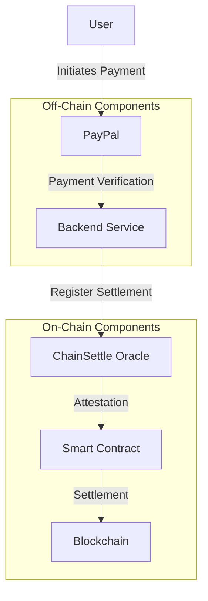
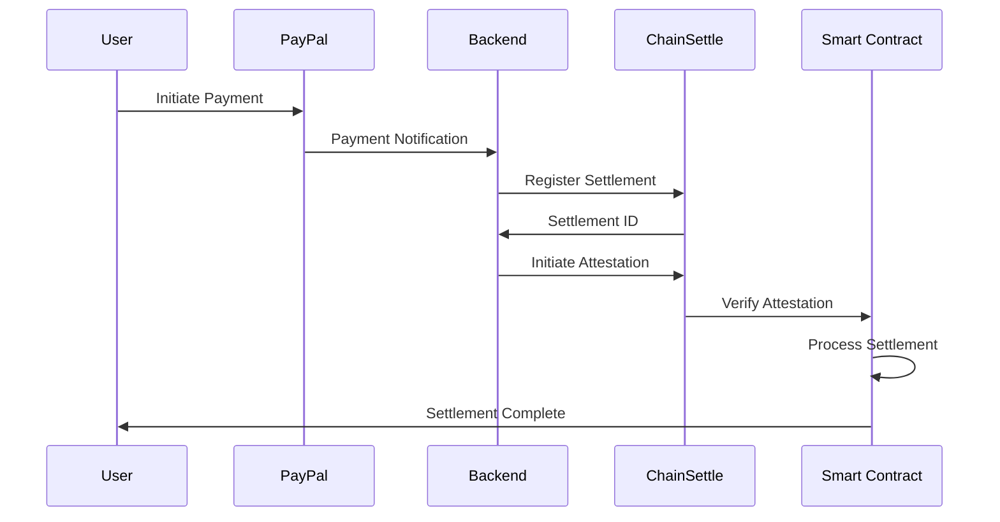
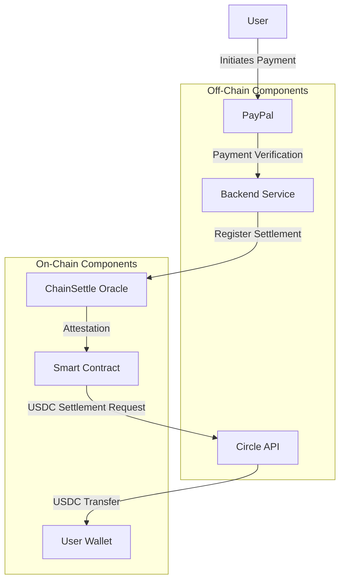

# Settlement To-dos & Roadmap

## To-do List

### High Priority

- [ ] Implement comprehensive error handling
- [ ] Add logging system
- [ ] Create monitoring dashboard
- [ ] Implement rate limiting
- [ ] Add API documentation
- [ ] **Circle Integration: Account Setup**
  - [ ] Create business account on Circle platform
  - [ ] Complete KYC/AML requirements for USDC integration
  - [ ] Generate and secure API keys

### Medium Priority

- [ ] Add more test cases
- [ ] Implement caching system
- [ ] Add metrics collection
- [ ] Create deployment scripts
- [ ] Add CI/CD pipeline
- [ ] **Circle Integration: Core USDC Implementation**
  - [ ] Integrate Circle API SDK into backend services
  - [ ] Implement USDC wallet creation and management
  - [ ] Add USDC settlement functionality to smart contracts
  - [ ] Set up webhook endpoints for USDC transaction notifications
  - [ ] Create transaction reconciliation service

### Low Priority

- [ ] Add user interface
- [ ] Implement analytics
- [ ] Create documentation website
- [ ] Add support for more payment methods
- [ ] Implement backup systems
- [ ] **Circle Integration: Advanced Features**
  - [ ] Implement Circle Cross-Chain Transfer Protocol (CCTP) for cross-chain
        USDC transfers
  - [ ] Add Circle Wallets API for embedded wallet functionality
  - [ ] Integrate with Circle Payments Network for FI connectivity
  - [ ] Implement Circle Contracts for additional tokenization features
  - [ ] Add Circle Paymaster to enable gas fees in USDC

## Circle Integration Roadmap

### Phase 1: USDC Settlement Foundation

1. **Account & API Setup**
   - [ ] Register for Circle business account
   - [ ] Configure API access and webhooks
   - [ ] Set up treasury wallet for USDC custody
   - [ ] Implement basic USDC transfer capabilities

2. **Smart Contract Integration**
   - [ ] Update SettlementRamp contract to support USDC token
   - [ ] Implement IERC20 interface for USDC interactions
   - [ ] Add settleWithUSDC function to handle USDC settlements
   - [ ] Create unit tests for USDC settlement functions

3. **Backend Services**
   - [ ] Create CircleService class in backend
   - [ ] Implement wallet address management
   - [ ] Add USDC balance checking functionality
   - [ ] Develop payment notification handling

### Phase 2: Advanced Features

1. **Cross-Chain Capabilities**
   - [ ] Integrate Circle's CCTP for native USDC transfers between chains
   - [ ] Support multiple blockchain networks (Ethereum, Base, etc.)
   - [ ] Implement cross-chain rebalancing for liquidity management

2. **Enhanced User Experience**
   - [ ] Add Circle Wallets API for embedded wallet experience
   - [ ] Implement QR code payment functionality
   - [ ] Create transaction history and reporting features

3. **Institutional Features**
   - [ ] Connect to Circle Payments Network for institutional settlement
   - [ ] Implement batch processing for high-volume transactions
   - [ ] Add compliance reporting tools

## Overview

Settlement Ramp is a blockchain-based solution that bridges off-chain payments
(like PayPal) with on-chain settlements, providing a secure and automated way to
verify and settle payments using smart contracts and a Python backend.

## Architecture



## Components

### 1. Smart Contracts

- **SettlementRamp.sol**: Main contract handling payment verification and
  settlement
- **Interfaces**:
  - ISettlementRegistry: Interface for ChainSettle oracle
  - IChainSettleAttest: Interface for attestation verification

### 2. Backend Services

- **Main Application**: FastAPI-based service
- **Services**:
  - PayPalService: Handles PayPal payment verification
  - ChainSettleService: Manages ChainSettle oracle interactions
  - BlockchainService: Handles blockchain interactions

### 3. Testing

- Unit tests for smart contracts
- Integration tests for backend services
- End-to-end testing scenarios

## Workflow



## USDC Settlement Implementation Using Circle

To implement the "Full USDC Settlement" feature using Circle products, integrate
the following components:

### Architecture Extension



### Circle Products Integration

1. **Circle Account Setup**
   - Create a business account on Circle
   - Complete necessary KYC/AML requirements
   - Generate API keys for integration

2. **Circle API Integration**
   - Add Circle SDK to backend services
   - Implement a new `CircleService` class in the backend
   - Configure webhook endpoints for payment notifications

3. **USDC Wallet Management**
   - Set up a treasury wallet for USDC custody
   - Implement wallet creation for new users
   - Configure custody and key management

4. **Payment Flow Implementation**
   - Add USDC settlement methods to smart contracts
   - Create a settlement processor service
   - Implement rate conversion from fiat to USDC

### Implementation Steps

1. **Backend Updates**
   ```python
   # Example CircleService class
   class CircleService:
       def __init__(self, api_key, api_url):
           self.api_key = api_key
           self.api_url = api_url
           self.headers = {"Authorization": f"Bearer {api_key}"}
           
       async def create_transfer(self, destination_address, amount, idempotency_key):
           payload = {
               "idempotencyKey": idempotency_key,
               "destination": {
                   "type": "blockchain",
                   "address": destination_address,
                   "chain": "BASE"
               },
               "amount": {
                   "currency": "USD",
                   "amount": amount
               }
           }
           response = await httpx.post(f"{self.api_url}/transfers", json=payload, headers=self.headers)
           return response.json()
   ```

2. **Smart Contract Updates**
   ```solidity
   // Add to SettlementRamp.sol

   // USDC token interface
   interface IERC20 {
       function transfer(address to, uint256 amount) external returns (bool);
       function balanceOf(address account) external view returns (uint256);
   }

   // USDC token on Base
   IERC20 public usdcToken;

   // Constructor update
   constructor(
       // existing parameters
       address _usdcTokenAddress
   ) {
       // existing code
       usdcToken = IERC20(_usdcTokenAddress);
   }

   // New settlement function with USDC
   function settleWithUSDC(bytes32 escrowId, address recipient, uint256 amount) 
       external 
       onlyAuthorizedAttester 
       nonReentrant 
   {
       require(payments[escrowId].payer != address(0), "Payment not found");
       require(!isSettled[escrowId], "Payment already settled");
       
       // Verify ChainSettle attestation
       (,,bool isFinalized) = settlementRegistry.getSettlement(escrowId);
       require(isFinalized, "Payment not finalized in ChainSettle");
       
       // Transfer USDC to recipient
       require(usdcToken.balanceOf(address(this)) >= amount, "Insufficient USDC balance");
       require(usdcToken.transfer(recipient, amount), "USDC transfer failed");
       
       isSettled[escrowId] = true;
       emit PaymentSettled(escrowId);
   }
   ```

3. **Configuration Updates**
   ```
   # Add to .env
   CIRCLE_API_KEY=
   CIRCLE_API_URL=https://api.circle.com/v1
   USDC_CONTRACT_ADDRESS=0x...  # Base mainnet USDC address
   ```

4. **Testing Strategy**
   - Create unit tests for Circle API interactions
   - Develop integration tests with Circle sandbox environment
   - Set up end-to-end tests for the complete payment flow

### Resources

- Circle API Documentation:
  [https://developers.circle.com/docs](https://developers.circle.com/docs)
- USDC on Base Protocol:
  [https://www.circle.com/blog/base-usdc](https://www.circle.com/blog/base-usdc)
- Circle Web3 Services:
  [https://www.circle.com/en/web3-services](https://www.circle.com/en/web3-services)

## Configuration

### Environment Variables

```bash
# Base Sepolia Configuration
BASE_SEPOLIA_RPC_URL=
SETTLEMENT_RAMP_CONTRACT_ADDRESS=
SETTLEMENT_REGISTRY_ADDRESS=

# ChainSettle Configuration
CHAINSETTLE_API_URL=
CHAINSETTLE_AKASH_URL=

# PayPal Configuration
PAYPAL_CLIENT_ID=
PAYPAL_CLIENT_SECRET=

# Circle Configuration
CIRCLE_API_KEY=
CIRCLE_API_URL=
USDC_CONTRACT_ADDRESS=

# Security
PRIVATE_KEY=

# API Configuration
API_HOST=0.0.0.0
API_PORT=8000
DEBUG=True
```

## Security Considerations

1. Private key management
2. API key security
3. Smart contract security
4. Oracle verification
5. Payment validation
6. USDC custody and treasury management
7. Circle API authentication security

## Deployment

### Smart Contract Deployment

1. Compile contracts
2. Deploy to Base Sepolia
3. Verify contract
4. Update environment variables

### Backend Deployment

1. Set up environment
2. Install dependencies
3. Configure services
4. Start application

## Testing

### Smart Contract Tests

```bash
forge test
```

### Backend Tests

```bash
pytest
```

## Future Enhancements

1. Support for multiple payment providers
2. Enhanced oracle integration
3. Advanced monitoring and analytics
4. User dashboard
5. Mobile application

## Contributing

1. Fork the repository
2. Create a feature branch
3. Make your changes
4. Submit a pull request

## License

MIT License

## Contact

For questions and support, please open an issue in the repository.
