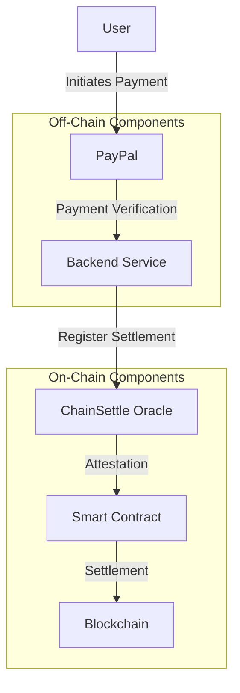
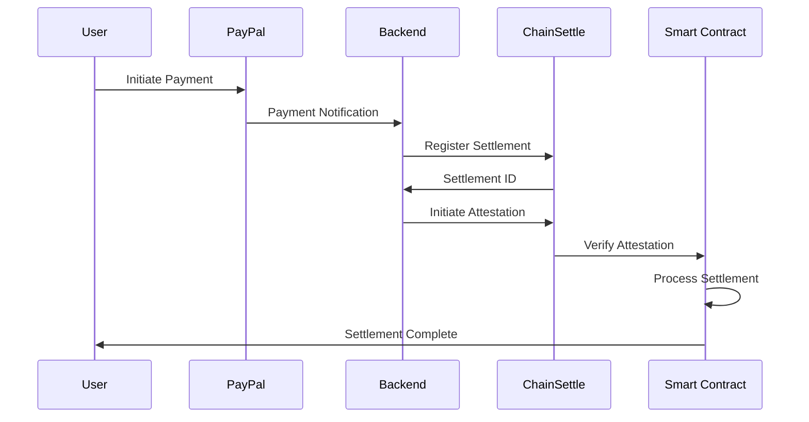

# Settlement Ramp Project Documentation

## Overview
Settlement Ramp is a blockchain-based solution that bridges off-chain payments (like PayPal) with on-chain settlements, providing a secure and automated way to verify and settle payments using smart contracts and a Python backend.

## Architecture



## Components

### 1. Smart Contracts
- **SettlementRamp.sol**: Main contract handling payment verification and settlement
- **Interfaces**:
  - ISettlementRegistry: Interface for ChainSettle oracle
  - IChainSettleAttest: Interface for attestation verification

### 2. Backend Services
- **Main Application**: FastAPI-based service
- **Services**:
  - PayPalService: Handles PayPal payment verification
  - ChainSettleService: Manages ChainSettle oracle interactions
  - BlockchainService: Handles blockchain interactions

### 3. Testing
- Unit tests for smart contracts
- Integration tests for backend services
- End-to-end testing scenarios

## Workflow



## Configuration

### Environment Variables
```bash
# Base Sepolia Configuration
BASE_SEPOLIA_RPC_URL=
SETTLEMENT_RAMP_CONTRACT_ADDRESS=
SETTLEMENT_REGISTRY_ADDRESS=

# ChainSettle Configuration
CHAINSETTLE_API_URL=
CHAINSETTLE_AKASH_URL=

# PayPal Configuration
PAYPAL_CLIENT_ID=
PAYPAL_CLIENT_SECRET=

# Security
PRIVATE_KEY=

# API Configuration
API_HOST=0.0.0.0
API_PORT=8000
DEBUG=True
```

## Security Considerations
1. Private key management
2. API key security
3. Smart contract security
4. Oracle verification
5. Payment validation

## Deployment

### Smart Contract Deployment
1. Compile contracts
2. Deploy to Base Sepolia
3. Verify contract
4. Update environment variables

### Backend Deployment
1. Set up environment
2. Install dependencies
3. Configure services
4. Start application

## Testing

### Smart Contract Tests
```bash
forge test
```

### Backend Tests
```bash
pytest
```

## TODO List

### High Priority
- [ ] Implement comprehensive error handling
- [ ] Add logging system
- [ ] Create monitoring dashboard
- [ ] Implement rate limiting
- [ ] Add API documentation

### Medium Priority
- [ ] Add more test cases
- [ ] Implement caching system
- [ ] Add metrics collection
- [ ] Create deployment scripts
- [ ] Add CI/CD pipeline

### Low Priority
- [ ] Add user interface
- [ ] Implement analytics
- [ ] Create documentation website
- [ ] Add support for more payment methods
- [ ] Implement backup systems

## Future Enhancements
1. Support for multiple payment providers
2. Enhanced oracle integration
3. Advanced monitoring and analytics
4. User dashboard
5. Mobile application

## Contributing
1. Fork the repository
2. Create a feature branch
3. Make your changes
4. Submit a pull request

## License
MIT License

## Contact
For questions and support, please open an issue in the repository.
